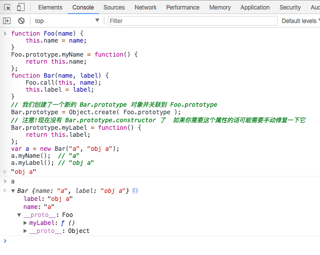
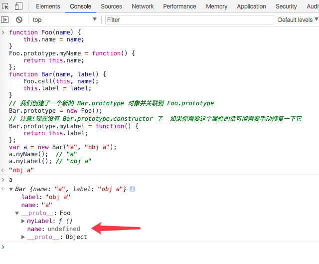

#### 原型
##### [[Prototype]]
JavaScript 中的对象都有一个特殊的 **[[Prototype]]内置** 属性.(`__proto__模拟`)

**[[Prototype]]** 有什么作用?  
当你试图引用对象的属性时会触发 [[Get]] 操作,比如 myObject.a。对于默认的 [[Get]] 操作来说,第一步是检查对象本身是否有这个属性,如果有的话就使用它,否则继续访问对象的 [[Prototype]] 链.

###### 属性设置和屏蔽
`myObject.foo = "bar"`  
如果 foo 不直接存在于 myObject 中而是存在于原型链上层时 myObject.foo = "bar" 会出现三种情况:  
1. 如果在[[Prototype]]链上层存在名为foo的普通数据访问属性并且没有被标记为只读(writable:false),那就会直接在 myObject 中添加一个名为 foo 的新属性,它是屏蔽属性。
2. 如果在[[Prototype]]链上层存在foo,但是它被标记为只读(writable:false),那么 无法修改已有属性或者在 myObject 上创建屏蔽属性。如果运行在严格模式下,代码会抛出一个错误。否则,这条赋值语句会被忽略。总之,不会发生屏蔽。
3. 如果在[[Prototype]]链上层存在foo并且它是一个setter,那就一定会 **调用** 这个 setter。foo 不会被添加到(或者说屏蔽于)myObject,也不会重新定义 foo 这 个 setter。

##### '类'
> 所有的 **函数** 默认都会拥有一个名为 prototype 的公有并且不可枚举的属性,它会指向另一个对象.

```js
function Foo() { }
Foo.prototype;    // { }
```
> **这个对象通常被称为 Foo 的原型**.

```js
function Foo() { // ...
}
var a = new Foo();
Object.getPrototypeOf( a ) === Foo.prototype; // true
```
调用new Foo()时会创建a(具体的4个步骤参见第2章),其中的一步就是给a一个内部的 [[Prototype]] 链接,关联到 Foo.prototype 指向的那个对象。

##### (原型)继承
```js
function Foo(name) {
    this.name = name;
}
Foo.prototype.myName = function() {
    return this.name;
};
function Bar(name, label) {
    Foo.call(this, name);
    this.label = label;
}
// 我们创建了一个新的 Bar.prototype 对象并关联到 Foo.prototype
Bar.prototype = Object.create( Foo.prototype );
// 注意!现在没有 Bar.prototype.constructor 了  如果你需要这个属性的话可能需要手动修复一下它
Bar.prototype.myLabel = function() {
    return this.label;
};
var a = new Bar("a", "obj a");
a.myName();  // "a"
a.myLabel(); // "obj a"
```
核心部分:`Bar.prototype = Object.create( Foo.prototype )`  
> 调用 Object.create(..) 会凭空创建一个“新”对象并把新对象内部的 [[Prototype]] 关联到你指定的对象(本例中是 Foo.prototype).  
声明 function Bar() { .. } 时,和其他函数一样,Bar 会有一个 .prototype 关联到默认的对象,但是这个对象并不是我们想要的 Foo.prototype。因此我们创建了一个新对象并把它关联到我们希望的对象上,直接把原始的关联对象抛弃掉!!

**错误做法!!!**
```js
// 和你想要的机制不一样!
Bar.prototype = Foo.prototype;
// 基本上满足你的需求,但是可能会产生一些副作用
Bar.prototype = new Foo();
```
下面是针对上面2种错误写法的解释:  
> Bar.prototype = Foo.prototype并不会创建一个关联到Bar.prototype的新对象,它只 是 让 Bar.prototype 直 接 引 用 Foo.prototype 对 象。 因 此 当 你 执 行 类 似 Bar.prototype. myLabel = ...的赋值语句时会直接修改Foo.prototype对象本身。显然这不是你想要的结 果,否则你根本不需要 Bar 对象,直接使用 Foo 就可以了,这样代码也会更简单一些。  

> Bar.prototype = new Foo()的确会创建一个关联到Bar.prototype的新对象。但是它使用 了 Foo(..) 的“构造函数调用”,如果函数 Foo 有一些副作用(比如写日志、修改状态、注册到其他对象、给 this 添加数据属性,等等)的话,就会影响到 Bar() 的“后代”,后果不堪设想。

**缺点以及解决办法**  
需要创建一个新对象然后把旧对象抛弃掉,不能 **直接** 修改已有的默认对象.
```js
// ES6 之前需要抛弃默认的 Bar.prototype
Bar.ptototype = Object.create( Foo.prototype );
// ES6 开始可以直接修改现有的Bar.prototype
Object.setPrototypeOf( Bar.prototype, Foo.prototype );
```
如果忽略掉 Object.create(..) 方法带来的轻微性能损失(抛弃的对象需要进行垃圾回收),它实际上比 ES6 及其之后的方法更短而且可读性更高。
###### 检查“类”关系
> 内省/反射 :检查一个实例(JavaScript 中的对象)的继承祖先(JavaScript 中的委托关联)

```js
function Foo() { // ...
}
Foo.prototype.blah = ...;
var a = new Foo();
//如何通过内省找出 a 的“祖先”(委托关联)呢?
```
方法一:
```js
a instanceof Foo; // true
```
instanceof 操作符的左操作数是一个普通的对象,右操作数是一个函数。instanceof 回答的问题是:在 a 的整条 [[Prototype]] 链中是否有指向 Foo.prototype 的对象?  
可惜,这个方法只能处理对象(a)和函数(带 .prototype 引用的 Foo)之间的关系。如果你想判断两个对象(比如 a 和 b)之间是否通过 [[Prototype]] 链关联,只用 instanceof 无法实现。
方法二:
```js
Foo.prototype.isPrototypeOf( a ); // true
//isPrototypeOf(..) 回答的问题是:
//在 a 的整条 [[Prototype]] 链中是否出现过 Foo.prototype ?

//只需要两个对象就可以判断它们之间的关系
//b 是否出现在 c 的 [[Prototype]] 链中?
b.isPrototypeOf( c );
```

绝大多数(不是所有!!!)浏览器也支持一种非标准的方法来访问内部 [[Prototype]] 属性:   
`a.__proto__ === Foo.prototype; // true`
`.__proto__` 模拟实现:
```js
Object.defineProperty(Object.prototype, "__proto__", {
    get: function() {
        return Object.getPrototypeOf(this);
    },
    set: function(o) {
        // ES6 中的 setPrototypeOf(..)
        Object.setPrototypeOf( this, o );
        return o;
    }
});
```

##### 对象关联
**原型链:**
> 如果在对象上没有找到需要的属性或者方法引用,引擎就会继续在 [[Prototype]] 关联的对象上进行查找。同理,如果在后者中也没有找到需要的 引擎就会继续查找它的 [[Prototype]],以此类推。这一系列对象的链接被称为“原型链”。

---
对于继承核心部分代码的思考:  
```js
Bar.prototype = Object.create( Foo.prototype );
Bar.prototype.constructor = Bar;
或 过桥函数
function inherits(Child, Parent) {
    var F = function () {};
    F.prototype = Parent.prototype;
    Child.prototype = new F();
    Child.prototype.constructor = Child;
}
// 实现原型继承链:
inherits(Bar, Foo);
//这两种方法都是可以的
```
为什么不采用`Bar.prototype = new Foo()`呢??  
对比图如下:  
**采用** `Object.create`:  
  
**采用** `new`:  


Foo原型链上的name属性对原型链造成了污染..
