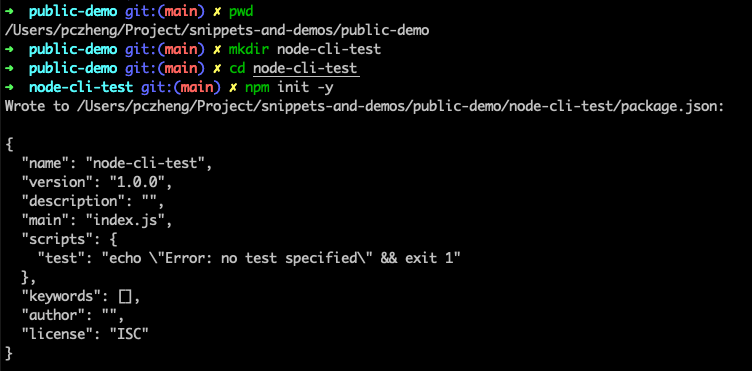
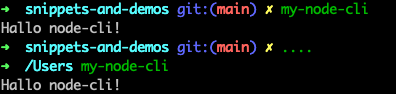
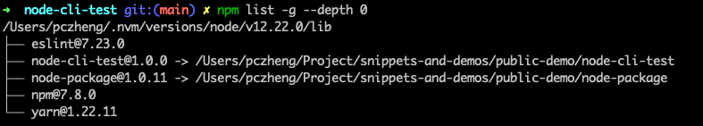
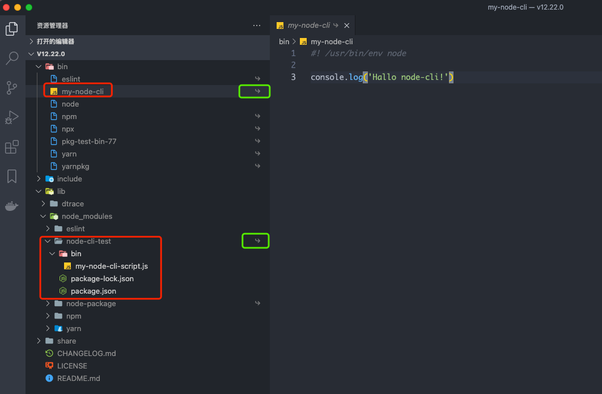
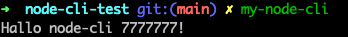
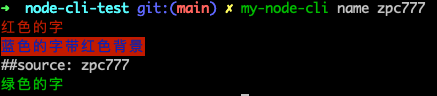
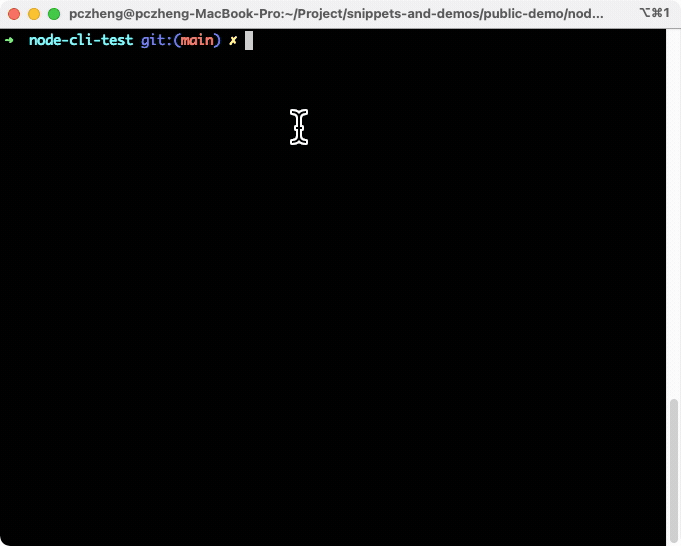

# 基于 `node` 制作命令行工具
使用  `node.js` 开发业务功能模块很常见, 得益于完善的社区, 他也可以用来快速开发命令行工具. 本文主要讲解大致的开发流程, 欢迎讨论.

## 初始化项目工程
> 可在此处找到完整[示例](https://github.com/zpc7/snippets-and-demos/tree/main/public-demo/node-cli-test)

进入目录, 使用 `npm init -y` 快速初始化项目 `node-cli-test`



对于 `node` 项目而言，模块导出入口文件由 `package.json` 中 `main` 字段决定，而如果是要安装到命令行的工具，则是由 `package.json` 中 `bin` 字段决定的。  
修改 `packgge.json`, 添加 `bin` 字段: 
```json diff
// pacgage.json
 "bin":{
   "my-node-cli": "bin/my-node-cli-script.js"
 },
```
相应的, 新增 `my-node-cli-script.js` 文件
```bash
#! /usr/bin/env node 

console.log('Hallo node-cli!')
```
> 注意代码中 `#! /usr/bin/env node`, `#!` 表示要指定脚本文件的解析程序, `/usr/bin/env` 表示要去哪里寻找解析程序, `node` 是解析程序的名字(表示此文件需要由 `node.js` 运行）

## 本地运行调试
目前为止, 我们已经新增了一个命令 `my-node-cli`, 在项目根目录执行以下命令:
```bash
npm link

// 以下是终端的输出
// added 1 package, and audited 3 packages in 3s

// found 0 vulnerabilities
```
完事后, 在终端任意位置执行 `my-node-cli` 都能看到我们期望的输出 `Hallo node-cli!`



实际上, 我们项目的这个包已经被安装到了本地的全局环境, 执行以下命令即可验证:
```bash
npm list -g --depth 0
```


`npm link` 实际在全局创建了到当前项目的软链接, 从上图中也可以看到其指向了我们项目 `node-cli-test` 的实际地址. 这个全局的路径为 `{prefix}/lib/node_modules/<package>`

以本机示例, 通过如下明日命令可获取 `prefix` 的值

```
npm config get prefix
// 本机执行的结果为: /Users/pczheng/.nvm/versions/node/v12.22.0
```

进入到对应的目录, 使用 vscode 打开, 可以发现:
- 在 `bin` 目录下有一个以我们定义的命令命名的文件 `my-node-cli`, 且其内容为我们在 `package.json` 的 `bin` 中指定的文件(`bin/my-node-cli-script.js`)的内容, 并且是一个软链接(windows的快捷方式/OSX的替身)
- 在 `lib/node_modules` 目录下有我们的原始项目文件夹 `node-cli-test`, 并且也是一个软链接



试试修改原始项目中的 `bin/my-node-cli-script.js`, 无需其他操作, 执行命令 `my-node-cli` 即可看到修改后的效果
```diff
#! /usr/bin/env node 

- console.log('Hallo node-cli!')
+ console.log('Hallo node-cli 7777777!')
```


目前为止, 已经可以使用我们自定义的命令 `my-node-cli` 了, 但是只能输出一条文本, 让我们来加点料!

## 使用命令行库 `commander.js`
> [commander.js](https://github.com/tj/commander.js) 是一个完整的 `node.js` 命令行解决方案。

**Talk is cheap. Show me the code.**
```
npm i commander -S
```
```diff js
// bin/my-node-cli-script.js

#! /usr/bin/env node 

- console.log('Hallo node-cli 7777777!')
+ const program = require('commander')
+ 
+ program
+   .version("0.0.1")
+   .description("A cli application named my-node-cli");
+ 
+ program.parse(process.argv);
```
执行 `my-node-cli -V` 即可打印出版本号 `0.0.1`

### 注册子命令
添加如下代码:
```diff
  program
    .version("0.0.1")
    .description("A cli application named my-node-cli");

+    program
+     .command('name <name>')
+     .description('添加新的名字')
+     .action(source => {
+         console.log('##source:', source)
+     })

  program.parse(process.argv)
```
此时, 终端执行 `my-node-cli` 会打印出如下提示信息: 
```
Usage: my-node-cli [options] [command]

A cli application named my-node-cli

Options:
  -V, --version   output the version number
  -h, --help      display help for command

Commands:
  name <name>     添加新的名字
  help [command]  display help for command
```
执行 `my-node-cli name zpc7777` 会打印 `##source: zpc7777`

### 注册参数(非子命令参数)
```js
program
  .option("-pe, --peppers", "Add peppers")
  .option("-pi, --pineapple", "Add pineapple")
  .option("-b, --bbq-sauce", "Add bbq sauce")
  .option(
    "-c, --cheese [type]",
    "Add the specified type of cheese [marble]",
    "marble"
  );
```
此时, 终端执行 `my-node-cli` 会打印出如下提示信息: 
```
Usage: my-node-cli [options] [command]

A cli application named my-node-cli

Options:
  -V, --version        output the version number
  -pe, --peppers        Add peppers
  -pi, --pineapple      Add pineapple
  -b, --bbq-sauce      Add bbq sauce
  -c, --cheese [type]  Add the specified type of cheese [marble] (default: "marble")
  -h, --help           display help for command

Commands:
  name <name>          添加新的名字
  help [command]       display help for command
```

这里就不再赘述了, 详细可以参考[官方文档](https://github.com/tj/commander.js/blob/master/Readme_zh-CN.md)

## 使用 `chalk` 给命令行输出字符带上颜色
> chalk 直译 '粉笔'
```
npm i chalk -s
```
```diff
+ const chalk = require("chalk");

program.version("0.0.1").description("A cli application named my-node-cli");

program
  .command("name <name>")
  .description("添加新的名字")
  .action((source) => {
+    console.log(chalk.red('红色的字')) 
+    console.log(chalk.blue.bgRed('蓝色的字带红色背景')) 
    console.log("##source:", source);
+    console.log(chalk.green('绿色的字')) 
  });
```
执行 `my-node-cli name zpc777` 打印如下:



## 使用 `Inquirer.js` 让命令行与用户进行输入/选择等交互
```
npm i inquirer -S
```
在 `program.parse(process.argv)` 之前新增如下代码:
```js
program
    .command('diy')
    .alias('d')
    .description('自定义用户输入')
    .action(option => {
        var config = {
            userName: '',
            description: '',
            cssStyle: '',
            jsOrTs:''
        }
        var promps = []

        console.log('🚀🚀🚀🚀🚀🚀🚀🚀')
        console.log(chalk.red('请按照提示操作, 可使用 Enter 和方向键'))     

        if(config.userName === '') {
              promps.push({
                type: 'input',
                name: 'userName',
                message: '请输入尊姓大名',
                validate: function (input){
                    if(!input) {
                        return '尊姓大名不能为空'
                    }
                    return true
                }
              })
        } 

        if(config.description === '') {
            promps.push({
                type: 'input',
                name: 'description',
                message: '请输入模块描述'
            })
        }

        if(config.cssStyle === '') {
          promps.push({
            type: 'list',
            name: 'cssStyle',
            message: '想用什么css预处理器?',
            choices: [
              {
                name: 'Sass/Scss',
                value: 'sass'
              },
              {
                name: 'Less',
                value: 'less'
              },
              {
                name: 'css-in-js',
                value: 'css-in-js'
              }
            ]
          })
        }
        if(config.jsOrTs === '') {
          promps.push({
            type: 'list',
            name: 'jsOrTs',
            message: '你喜欢JS还是TS?',
            choices: [
              {
                name: 'Typescript',
                value: 'TS'
              },
              {
                name: 'Javascript',
                value: 'JS'
              }
            ]
          })
        }

        inquirer.prompt(promps).then(function (answers) {
            console.log(chalk.blue('Done'))
            console.log('你的回答如下:',answers)
        })
    }) 
```
此时执行 `my-node-cli diy` 或 `my-node-cli d` 会出现如下的交互:



## 发布

## 其他推荐的三方库
- [命令行进度条](https://github.com/visionmedia/node-progress)
- [命令行加载中图标](https://github.com/sindresorhus/ora)


## 参考链接
- [从 1 到完美，用 node 写一个命令行工具](https://segmentfault.com/a/1190000016555129)
- [跟着老司机玩转Node命令行](https://jelly.jd.com/article/6006b1045b6c6a01506c87b4)
- [npm link的使用](https://www.jianshu.com/p/aaa7db89a5b2)
- [npm Docs](https://docs.npmjs.com/cli/v7/configuring-npm/package-json#description)


