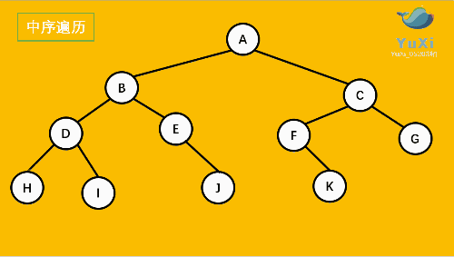
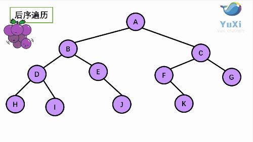

# 二叉树的遍历方式
对于二叉树，有深度遍历(DFS)和广度遍历(BFS)，深度遍历有前序、中序以及后序三种遍历方法，广度遍历即我们平常所说的层次遍历。

准备一个树的结构，用于后面的遍历演示

```js
const tree = {
  val: "A",
  left: {
    val: "B",
    left: {
      val: "D",
      left: {
        val: "H",
      },
      right: {
        val: "I",
      },
    },
    right: {
      val: "E",
      right: {
        val: "J",
      },
    },
  },
  right: {
    val: "C",
    left: {
      val: "F",
      right: {
        val: "K",
      },
    },
    right: {
      val: "G",
    },
  },
};
```

## 先序遍历(前序遍历)

先序遍历：根结点 ---> 左子树 ---> 右子树

先序遍历可以想象成，小人从树根开始绕着整棵树的外围转一圈，经过结点的顺序就是先序遍历的顺序


先序遍历结果：**ABDHIEJCFKG**

让我们来看下动画，和小人儿一起跑两遍就记住啦，记住是绕着外围跑哦


leetcode原题: [二叉树的前序遍历](https://leetcode.cn/problems/binary-tree-preorder-traversal/description/)

### 递归

```js
function preOrderTraversal(root) {
  const res = []; // 结果数组
  // 递归函数
  function _preOrder(node) {
    if (node) {
      res.push(node.val);
      _preOrder(node.left);
      _preOrder(node.right);
    }
  }
  _preOrder(root);

  return res;
}

console.log("@@@result:", preOrderTraversal(tree));
// @@@result: [ 'A', 'B', 'D', 'H', 'I', 'E', 'J', 'C', 'F', 'K', 'G' ]
```

### 迭代

通过栈数据结构(FIFO 先进后出)，我们可以将父节点压入栈-->对栈执行出栈操-->每次将出栈节点的右子树先压入栈，其次压入左子树。这样就可以做到先遍历父节点，再遍历左子树，最后遍历右子树。


```js
function preOrderTraversal(root) {
  if (!root) return [];

  const result = [];
  const stack = [root];

  while (stack.length) {
    // 栈顶的元素出栈
    const cur = stack.pop();
    result.push(cur.val);
    // 子节点存在压入栈中，先右再左
    cur.right && stack.push(cur.right);
    cur.left && stack.push(cur.left);
  }
  return result;
}
```

## 中序遍历

中序遍历：左子树 ---> 根结点 ---> 右子树

中序遍历可以想象成，`按树画好的左右位置投影下来`就可以了


中序遍历结果：**HDIBEJAFKCG**



leetcode原题: [二叉树的中序遍历](https://leetcode.cn/problems/binary-tree-inorder-traversal/description/)

### 二叉搜索树的中序遍历

二叉搜索树(Binary Search Tree 简称 `BST`)定义如下：
* 左子树上所有节点的值都小于它的根节点
* 右子树上所有的节点的值都大于它的根节点


上面的二叉搜索树的中序遍历结果是: **[19, 28, 31, 33, 35, 40, 45]**

重要结论: **二叉搜索树的中序遍历的节点值数组是一个有序数组**

### 递归

```js
function inOrderTraversal(root) {
  const res = [];
  // 递归函数
  function _inOrder(node) {
    if (node) {
      _inOrder(node.left);
      res.push(node.val);
      _inOrder(node.right);
    }
  }
  _inOrder(root);
  
  return res;
}
```

### 迭代

同样可以使用栈结构来实现中序遍历，因为中序遍历左子树是优先遍历，所以父节点要先于子树的节点优先压入栈中，每当我们压入节点时，都要把节点的左子树的所有左节点压入栈中。


```js
function inOrderTraversal(root) {
  if (!root) return [];

  const res = [];
  const stack = [];

  let cur = root; // 记录当前遍历位置, 用于下面的 while 循环
  while (stack.length || cur) {
    // 当前节点的所有左节点都先压入栈
    // 全部入栈后 cur 为 undefined了
    while (cur) {
      stack.push(cur);
      cur = cur.left;
    }
    // 依次出站
    const node = stack.pop();
    res.push(node.val);
    // 如果栈顶节点右子树存在, 修改cur指向, 使在下次 while 中, 其所有左子树入栈
    if (node.right != null) {
      cur = node.right;
    }
  }
  return res;
}
```

## 后序遍历

中序遍历：左子树 ---> 右子树 ---> 根结点

后序遍历就像是剪葡萄，我们要把一串葡萄剪成一颗一颗的。

就是围着树的外围绕一圈，如果发现一剪刀就能剪下的葡萄（必须是一颗葡萄），就把它剪下来，组成的就是后序遍历了。


后序遍历结果：**HIDJEBKFGCA**



leetcode原题: [二叉树的后序遍历](https://leetcode.cn/problems/binary-tree-postorder-traversal/)

### 递归

```js
function postOrderTraversal(root) {
  const res = [];
  // 递归函数
  function _postOrder(node) {
    if (node) {
      _postOrder(node.left);
      _postOrder(node.right);
      res.push(node.val);
    }
  }
  _postOrder(root);

  return res;
}
```

### 迭代

后序遍历是父节点需要最后被遍历。但其实跟前序遍历的实现方式上差不多，只不过在插入数组中，我们总是在头部插入，这样先被插入的节点值一定是相对于左右子树后面的。


```js
function postOrderTraversal(root) {
  if (!root) return [];

  const res = [];
  const stack = [root];

  while (stack.length) {
    // 出栈
    const cur = stack.pop();
    // 总是头部插入，先被插入的在后面
    res.unshift(cur.val);
    cur.left && stack.push(cur.left);
    cur.right && stack.push(cur.right);
  }

  return res;
};
```

## 层序遍历

层序遍历就是按照一层一层的顺序，从左到右写下来就行了。


后序遍历结果：**ABCDEFGHIJK**

leetcode原题: [二叉树的层序遍历](https://leetcode.cn/problems/binary-tree-level-order-traversal/)

### 递归

```js
function levelOrder(root) {
  const res = [];
  
  function _levelOrder(node, level) {
    if (node) {
      // 当前层数组初始化
      res[level] = res[level] || [];
      res[level].push(node.val);
      // 下一层 +1
      _levelOrder(node.left, level + 1);
      _levelOrder(node.right, level + 1);
    }
  }
  _levelOrder(root, 0);

  return res;
}

console.log("@@@result:", levelOrder(tree));
//@@@result: [ [ 'A' ], [ 'B', 'C' ], [ 'D', 'E', 'F', 'G' ], [ 'H', 'I', 'J', 'K' ] ]
```

### 迭代

使用队列来保存节点，每轮循环中，我们都取一层出来，将它们的左右孩子放入队列

```js
function levelOrder(root) {
  if (root === null) return [];

  let level = 0;
  const res = [];
  const queue = [root];
  
  while (queue.length) {
    res.push([]);
    const len = queue.length;
    // 通过遍历，提前执行完一层的所有元素，层级level就可以+1
    for (let i = 0; i < len; i++) {
      const node = queue.shift();
      res[level].push(node.val);
      node.left && queue.push(node.left);
      node.right && queue.push(node.right);
    }
    level++;
  }
  return res;
}
```

## 参考链接

* [理解二叉树的四种遍历-前序、中序、后序、层序](http://www.hangdaowangluo.com/archives/2979)
* [JS实现二叉树的前序、中序、后续、层序遍历](https://juejin.cn/post/6844904063650234375)
