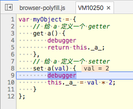

# 你不知道的JS上-对象
## 对象的类型
在 JavaScript 中一共有六种主要语言类型:  
**string** **number** **boolean** **null** **undefined** **object**(首字母小写)
> 简单基本类型(string、boolean、number、null 和 undefined)本身并不是对象。

> null 有时会被当作一种对象类型,但是这其实只是语言本身的一个 bug,即对 null 执行 typeof null 时会返回字符串 "object"。  
实际上,null 本身是基本类型,原理是这样的,不同的对象在底层都表示为二进制,在 JavaScript 中二进制前三位都为 0 的话会被判 断为 object 类型,null 的二进制表示是全 0,自然前三位也是 0,所以执行 typeof 时会返回“object”。

JavaScript 中还有一些**对象**子类型,通常被称为**内置对象**:  
**String** **Number** **Boolean** **Object** **Function** **Array**
 **Date** **RegExp** **Error**(首字母大写)
> 在 JavaScript 中,它们实际上只是一些内置函数。这些内置函数可以当作构造函数 (由 new 产生的函数调用)来使用,从而可以构造一个对应子类型的新对象(注意!!是对象)。

```js
var strPrimitive = "I am a string";
typeof strPrimitive;             // "string"
strPrimitive instanceof String;  // false
var strObject = new String( "I am a string" );
typeof strObject;                // "object"
strObject instanceof String;     // true
// 检查 sub-type 对象
Object.prototype.toString.call( strObject );
// [object String] (注意!!object小写,String大写)
```
## 对象的内容
### 属性 
> 在对象中,属性名永远都是字符串。如果你使用 string(字面量)以外的其他值作为属性名,那它首先会被转换为一个字符串。即使是数字也不例外,虽然在数组下标中使用的的确是数字,但是在对象属性名中数字会被转换成字符串,所以当心不要搞混对象和数组中数字的用法

```js
var myObject = { };
myObject[true] = "foo";
myObject[3] = "bar";
myObject[myObject] = "baz";

myObject["true"];                 // "foo"
myObject["3"];                    // "bar"
myObject["[object Object]"];      // "baz"
```
### 数组 
> 你完全可以把数组当作一个普通的键 / 值对象来使用,并且不添加任何数值索引,但是这并不是一个好主意。**数组和普通的对象都根据其对应的行为和用途进行了优化**,所以最好只用对象来存储键 / 值对,只用数组来存储数值下标 / 值对

注意:如果你试图向数组添加一个属性,但是属性名“看起来”像一个数字,那它会变成一个数值下标(因此会修改数组的内容而不是添加一个属性):
```js
    var myArray = [ "foo", 42, "bar" ];
    myArray["3"] = "baz"; myArray.length;      // 4
    myArray[3];                                // "baz"
```
### 复制对象
需要考虑的问题:  
- 深复制还是浅复制?
- 深复制存在循环引用怎么解决?应该检测循环引用并终止循环(不复制深层元素)?还是应当直接报错或者是选择其他方法?

深复制代码参考[采集自冴羽](https://github.com/mqyqingfeng/Blog/issues/32):
```js
var deepCopy = function(obj) {
    if (typeof obj !== 'object') return;
    var newObj = obj instanceof Array ? [] : {};
    for (var key in obj) {
        if (obj.hasOwnProperty(key)) {
            newObj[key] = typeof obj[key] === 'object' ? deepCopy(obj[key]) : obj[key];
        }
    }
    return newObj;
}
```
### 属性描述符(数据描述符)
获取普通的对象属性对应的属性描述符
```js
var myObject = {
    a:2
};
Object.getOwnPropertyDescriptor( myObject, "a" );
//{
// value: 2,
// writable: true,     //可写
// enumerable: true,   //可枚举
// con gurable: true   //可配置
// }
```
> 在创建普通属性时属性描述符会使用默认值,我们也可以使用 **Object.defineProperty(..)** 来添加一个新属性或者修改一个已有属性(如果它是 configurable)并对特性进行设置。

```js
var myObject = {};
Object.defineProperty( myObject, "a", {
    value: 2,
    writable: true,
    configurable: true,
    enumerable: true
});
myObject.a;     // 2
```
1. **writable** 决定是否可以修改属性的值。
2. **Configurable** 只要属性是可配置的,就可以使用 defineProperty(..) 方法来修改属性描述符。  
  - 不管是不是处于严格模式,尝试修改一个不可配置的属性描述符都会出错。把 configurable 修改成 false 是单向操作,无法撤销!
  - 要注意有一个小小的例外:即便属性是 configurable:false,我们还是可以把 writable 的状态由 true 改为 false,但是无法由 false 改为 true。
  - 除了无法修改,configurable:false 还会禁止删除这个属性。
3. **Enumerable** 这个描述符控制的是属性是否会出现在对象的属性枚举中,比如说 for..in 循环。

### 不变性
不变性就是指代属性或者对象是不可改变(无论有意还是无意)的.
> 所有的方法创建的都是浅不变形,也就是说,它们只会影响目标对象和 它的 **直接** 属性。如果目标对象引用了其他对象(数组、对象、函数,等),其他对象的内 容不受影响,仍然是可变的


1. **对象常量** 结合 writable:false 和 configurable:false 就可以创建一个真正的常量属性(不可修改、 重定义或者删除)
2. **禁止扩展** 如果你想禁止一个对象添加新属性并且保留已有属性,可以使用Object.prevent Extensions(..)
3. **密封** Object.seal(..) 会创建一个“密封”的对象,这个方法实际上会在一个现有对象上调用 Object.preventExtensions(..) 并把所有现有属性标记为 configurable:false。
所以,密封之后不仅不能添加新属性,也不能重新配置或者删除任何现有属性(虽然可以 修改属性的值)。
4. **冻结** Object.freeze(..) 会创建一个冻结对象,这个方法实际上会在一个现有对象上调用 Object.seal(..) 并把所有“数据访问”属性标记为 writable:false,这样就无法修改它们的值。

### [[Get]]
```js
var myObject = { a:2 };
myObject.a;     // 2
```
myObject.a 是一次属性访问,但是这条语句并不仅仅是在 myObjet 中查找名字为 a 的属性, 虽然看起来好像是这样。  
在语言规范中,myObject.a 在 myObject 上实际上是实现了 [[Get]] 操作(有点像函数调 用:`[[Get]]()`)。对象默认的内置 [[Get]] 操作首先在对象中查找是否有名称相同的属性, 如果找到就会返回这个属性的值。
### [[Put]]
[[Put]] 被触发时,如果已经存在这个属性,[[Put]] 算法大致会检查下面这些内容。
1. 属性是否是 *访问描述符* ?如果是并且存在setter就调用setter。
2. 属性的数据描述符中writable是否是false?如果是,在非严格模式下静默失败,在
严格模式下抛出 TypeError 异常。
3. 如果都不是,将该值设置为属性的值。

### Getter和Setter
对象默认的 [[Put]] 和 [[Get]] 操作分别可以控制属性值的设置和获取。  
在 ES5 中可以使用 getter 和 setter 部分改写默认操作,但是只能应用在单个属性上,无法应用在整个对象上。getter 是一个隐藏函数,会在获取属性值时调用。setter 也是一个隐藏函数,会在设置属性值时调用。
> 当你给一个属性定义 getter、setter 或者两者都有时,这个属性会被定义为“访问描述 符”(和“数据描述符(属性描述符)”相对)。对于访问描述符来说,JavaScript 会忽略它们的 value 和 writable 特性,取而代之的是关心 set 和 get(还有 configurable 和 enumerable)特性。

应该同时为属性定义getter和setter
```js
var myObject = {
    // 给 a 定义一个 getter
    get a() {
        debugger
        return this._a_;
    },
    // 给 a 定义一个 setter
    set a(val) {
        debugger
        this._a_ = val * 2;
    }
};

    myObject.a = 2;
    myObject.a; // 4
```
以上代码,执行`myObject.a = 2`时候,setter效果如图  
  
所以最终的效果`myObject.a = 4`

### 存在性
```js
var myObject = { a:2 };
    ("a" in myObject); // true
    ("b" in myObject); // false
    myObject.hasOwnProperty( "a" ); // true
    myObject.hasOwnProperty( "b" ); // false
```
in 操作符会检查属性是否在对象及其 [[Prototype]] 原型链中。相比之下, hasOwnProperty(..) 只会检查属性是否在 myObject 对象中,不会检查 [[Prototype]] 链。
> 看起来 in 操作符可以检查容器内是否有某个值,但是它实际上检查的是某 个属性名是否存在。对于数组来说这个区别非常重要,4 in [2, 4, 6]的结 果并不是你期待的True,因为[2, 4, 6]这个数组中包含的属性名是0、1、 2,没有 4。

```js
var myObject = { };
// 让 a 像普通属性一样可以枚举
Object.defineProperty( myObject, "a",{ enumerable: true, value: 2 });
//让b不可枚举
Object.defineProperty( myObject, "b",{ enumerable: false, value: 3});

myObject.b;                         // 3
("b" in myObject);                  // true
myObject.hasOwnProperty( "b" );     // true

for (var k in myObject) {
    console.log( k, myObject[k] );
}    //"a"2
```
注意!!!  
Object.b 确实存在并且有访问值,但是却不会出现在 for..in 循环中(尽管 可以通过 in 操作符来判断是否存在)。原因是“可枚举”就相当于“**可以出现在对象属性的遍历中**”。  
**如何知道某一个属性是否可以枚举呢??**  
针对上一个实例:
```js
myObject.propertyIsEnumerable( "a" );    // true
myObject.propertyIsEnumerable( "b" );    // false
Object.keys( myObject );                 // ["a"]
Object.getOwnPropertyNames( myObject );  // ["a", "b"]
```
propertyIsEnumerable(..) 会检查给定的属性名是否直接存在于对象中(而不是在原型链上)并且满足 enumerable:true。  
Object.keys(..) 会返回一个数组,包含所有可枚举属性,Object.getOwnPropertyNames(..) 会返回一个数组,包含所有属性,无论它们是否可枚举。  
in 和 hasOwnProperty(..) 的区别在于是否查找 [[Prototype]] 链,然而,Object.keys(..) 和 Object.getOwnPropertyNames(..) 都只会查找对象直接包含的属性。

## 遍历
使用 for..in 遍历对象是无法直接获取属性值的,因为它实际上遍历的是对象中的所有**可枚举属性**,你需要手动获取属性值  
ES6 增加了一种用来遍 历数组的for..of循环语法(如果对象本身定义了迭代器的话也可以遍历对象)
```js
varmyArray=[1,2,3];
for (var v of myArray) { console.log( v );
}
//1
//2
//3
```
for..of 循环首先会向被访问对象请求一个迭代器对象,然后通过调用迭代器对象的 next() 方法来遍历所有返回值。数组有内置的 @@iterator,因此 for..of 可以直接应用在数组上。普通的对象没有内置的 @@iterator,所以无法自动完成 for..of 遍历。
