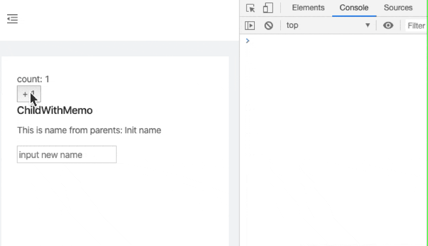
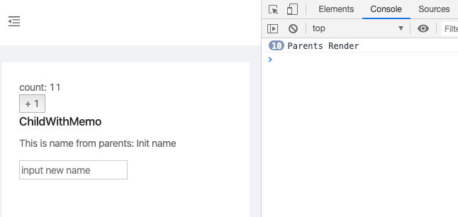

我们先用 `Hooks` 重写下 [PureComponent+memo](./React-PureComponent+memo.md) 中的例子:

```jsx
import React, { useState, memo } from "react";

const ChildWithMemo = memo(() => {
  console.log("MemoChild Render");
  return <div>ChildWithMemo</div>;
});

export default function Parents() {
  const [count, setCount] = useState(1);
  console.log("Parents Render");

  const handleClick = () => setCount(count + 1);
  
  return (
    <div>
      <div>count: {count}</div>
      <button onClick={handleClick}>+ 1</button>
      <ChildWithMemo />
    </div>
  );
}
```

现在的子组件 `ChildWithMemo` 没有接收任何props, 我们简单改造下示例:  

```jsx
const ChildWithMemo = memo(({ name, updateName }) => {
  console.log("MemoChild Render");
  return <div>
    <h2>ChildWithMemo</h2>
    <p>This is name from parents: {name} </p>
    <input onChange={updateName} placeholder='input new name' />
  </div>;
});

export default function Parents() {
  const [count, setCount] = useState(1);
  const [name, setName] = useState('Init name');
  console.log("Parents Render");
  
  const handleClick = () => setCount(count + 1)
  const updateName = e => setName(e.target.value);

  return (
    <div>
      <div>count: {count}</div>
      <button onClick={handleClick}>+ 1</button>
      <ChildWithMemo name={name} updateName={updateName} />
    </div>
  );
}

```
当我们点击按钮给 count 加 1 的时候, 子组件 `ChildWithMemo` 并没有使用到 count ,但还是重新渲染了, 这是什么原因?

 

原因就在于 function `updateName` , 每次父组件重新 render 的时候, 都生成了一个新的 function.  
让我们用 `useCallback` 来优化:
```jsx
- const updateName = e => setName(e.target.value);
+ const updateName = useCallback(e => setName(e.target.value), []);
```
现在重新测试, 子组件就不会再重新渲染了

  
那么 `useCallback` 究竟有什么魔力呢
### [useCallback](https://reactjs.org/docs/hooks-reference.html#usecallback)
> Pass an inline callback and an array of dependencies. useCallback will return a memoized version of the callback that only changes if one of the dependencies has changed. This is useful when passing callbacks to optimized child components that rely on reference equality to prevent unnecessary renders (e.g. shouldComponentUpdate).  
传递内联的回调函数和依赖项数组。 useCallback 将返回回调函数的缓存 `memoized` 版本，只有当其中一个依赖项发生变化时 函数才会变化。 这在将回调传递给优化的子组件时非常有用，这些子组件依赖于引用相等性来防止不必要的渲染(例如 shouldComponentUpdate)。

官方示例:
```js
const memoizedCallback = useCallback(
  () => {
    doSomething(a, b);
  },
  [a, b],
);
```
`useCallback(fn, deps)` 等价于 `useMemo(() => fn, deps)`  
简单说来, useCallback 用来避免生成多余的callback function, 参考上面的示例.


接下来我们考虑另外的场景, 上面示例中, `ChildWithMemo` 的 props `name` 是一个简单的值类型, 如果是复杂类型呢?  
我们来做一个改造:
```jsx
const ChildWithMemo = memo(({ profile, updateName }) => {
  console.log("MemoChild Render");
  return <div>
    <h3>ChildWithMemo</h3>
    <p>This is name from parents: {profile.name} </p>
    <p>This is persistent age from parents: {profile.age} </p>
    <input onChange={updateName} placeholder='input new name' />
  </div>;
});

export default function Parents() {
  const [count, setCount] = useState(1);
  const [name, setName] = useState('Init name');
  console.log("Parents Render");

  const handleClick = () => setCount(count + 1)
  const updateName = useCallback(e => setName(e.target.value), []);
  const profile = { name, age: 24 };

  return (
    <div>
      <div>count: {count}</div>
      <button onClick={handleClick}>+ 1</button>
      <ChildWithMemo profile={profile} updateName={updateName} />
    </div>
  );
}
```

在这个例子中, 我们把 `ChildWithMemo` 的 props 由 string 的 `name` 变成了一个引用类型的 `profile = { name, age: 24 }` , 当我们点击按钮给 count 加 1 的时候, 子组件 `ChildWithMemo` 又开始重新渲染了!!!  这又是为什么呢?  
原因就在于 每次父组件重新 render 的时候, 都生成了一个新的 对象 `{ name, age: 24 }`  

让我们用 `useMemo` 来优化:

```js
- const profile = { name, age: 24 };
+ const profile = useMemo(() => ({ name, age: 24 }), [name])
```
现在重新测试, 子组件就不会再重新渲染了
### [useMemo](https://reactjs.org/docs/hooks-reference.html#usememo)
> useMemo Returns a memoized value. Pass a “create” function and an array of dependencies. useMemo will only recompute the memoized value when one of the dependencies has changed. This optimization helps to avoid expensive calculations on every render.

官方示例:
```
const memoizedValue = useMemo(() => computeExpensiveValue(a, b), [a, b]);
```


至此, 我们的优化就告一段落了.

总结:
- 在子组件不需要父组件的值和函数的情况下，只需要使用 `memo` 包裹函数子组件即可(参考上节)。
- 在子组件需要父组件的值和函数的情况下，有函数传递给子组件时 使用 `useCallback`, 有值(有依耐项)传递给子组件时 使用 `useMemo`  
(一个用来缓存函数, 一个用来缓存值~)
