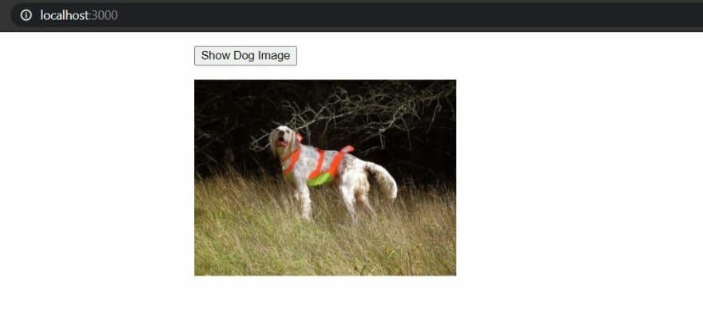
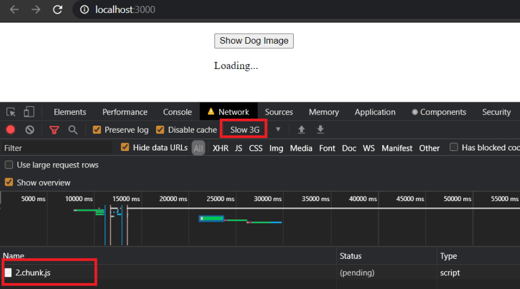
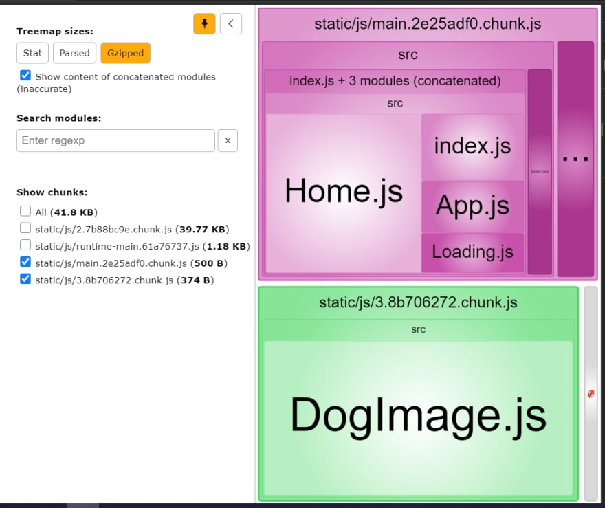
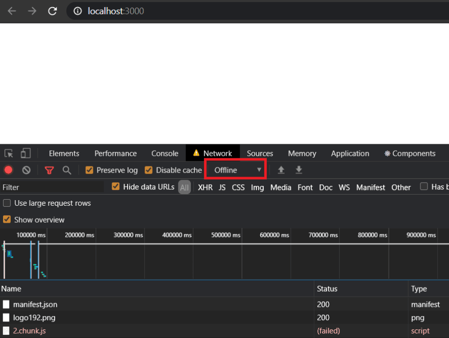
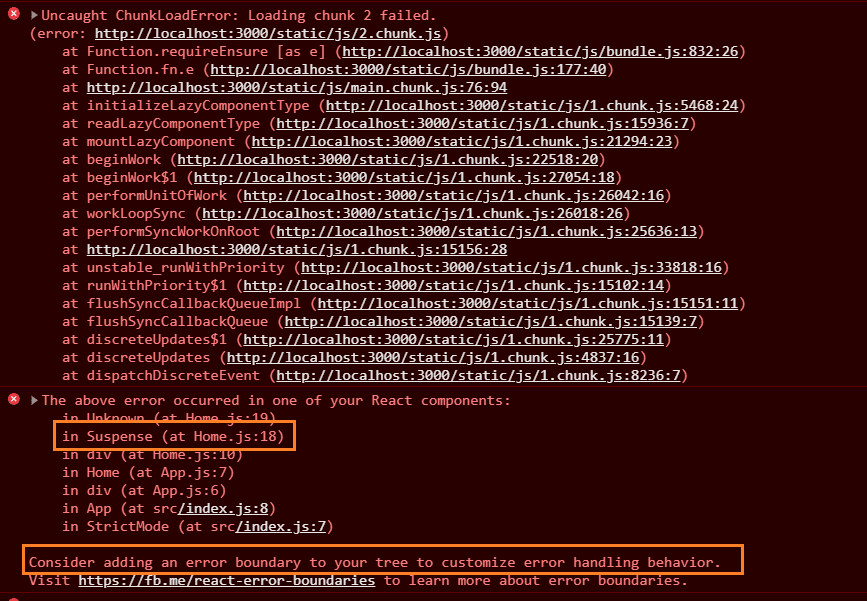
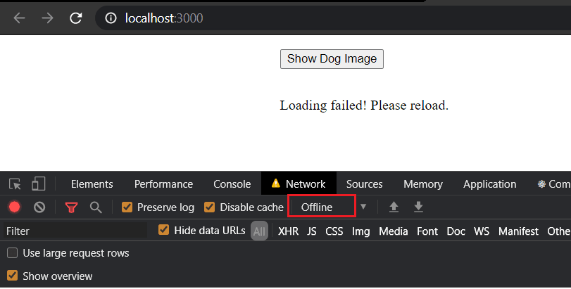
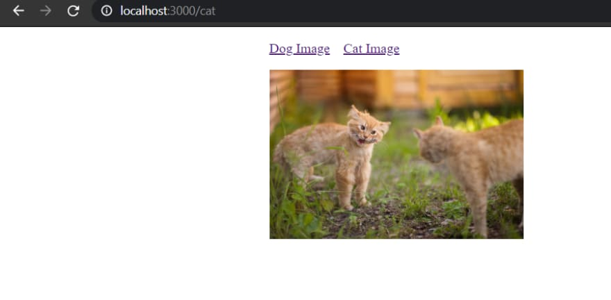
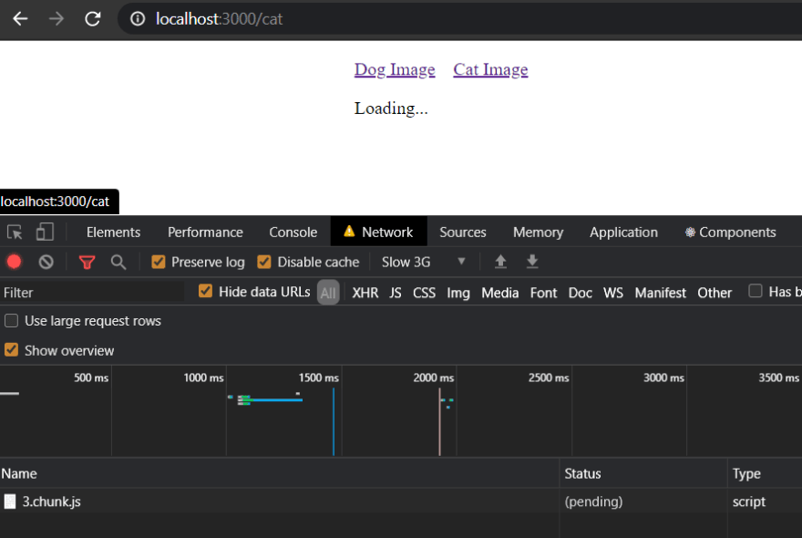
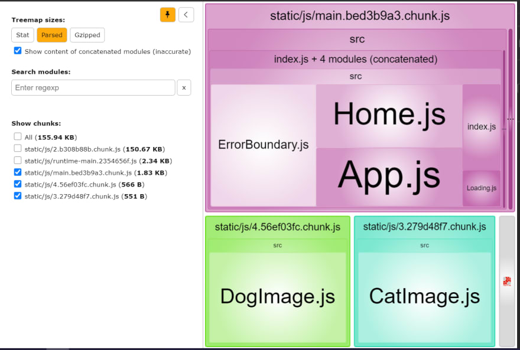

# 使用 `React.lazy` 和 `@loadable/component` 在 `React` 中拆分代码
> 当我们的项目持续增长并添加越来越多的功能时，我们最终会添加大量代码和三方库，从而导致打包体积变大。
> 几百 KB 的包大小可能不会感觉很多，但在较慢的网络或移动网络中，加载时间会更长，从而造成糟糕的用户体验。

> 这个问题的解决方案是减小包的大小。
> 但是如果我们删除体积较大的包，功能就会被破坏。因此，我们不会删除包，而只会加载特定页面所需的 js 代码。
> 每当用户在页面上导航或执行操作时，我们才会即时下载代码，
> 从而加快初始页面加载速度。

当 `Create React App` 为生产构建代码时，它只生成 2 个主要文件：

- 具有 React 基础库代码及其依赖项的文件。
- 包含您的应用程序逻辑及其依赖项的文件。

因此，要为每个组件或每个路由生成一个单独的文件，我们可以使用 `React.lazy`，
它与 react 或任何其他第三方库一起开箱即用。在本教程中，我们将看到两种方式。


## 初始项目设置
使用以下命令创建 React 应用程序：
```bash
npx create-react-app code-splitting-react
```
## 使用 `React.lazy` 进行代码拆分
使用以下代码在 `Home.js` 文件内创建一个新组件 `Home`：
```jsx
import React, { useState } from "react"

const Home = () => {
  const [showDetails, setShowDetails] = useState(false)
  return (
    <div>
      <button
        onClick={() => setShowDetails(true)}
        style={{ marginBottom: "1rem" }}
      >
        Show Dog Image
      </button>
    </div>
  )
}
export default Home
```
这里我们有一个按钮，点击后会将 `showDetails` 的 state 设置为 `true`。

现在使用以下代码创建新组件 `DogImage`：
```jsx
import React, { useEffect, useState } from "react"

const DogImage = () => {
  const [imageUrl, setImageUrl] = useState()
  useEffect(() => {
    fetch("https://dog.ceo/api/breeds/image/random")
      .then(response => {
        return response.json()
      })
      .then(data => {
        setImageUrl(data.message)
      })
  }, [])

  return (
    <div>
      {imageUrl && (
        
      )}
    </div>
  )
}

export default DogImage
```
在这个组件中，每当组件被挂载时，我们都会使用钩子函数 `useEffect` 从 [Dog API](https://dog.ceo/dog-api/) 中获取随机的狗狗图像。  
当图像的 URL 可用时，我们将显示它。

现在把组件 `DogImage` 加入到组件 `Home` 中，并设置 `showDetails` 为 `true` 时才显示它：
```jsx
import React, { useState } from "react"
import DogImage from "./DogImage"
const Home = () => {
  const [showDetails, setShowDetails] = useState(false)
  return (
    <div>
      <button
        onClick={() => setShowDetails(true)}
        style={{ marginBottom: "1rem" }}
      >
        Show Dog Image
      </button>
      {showDetails && <DogImage />}
    </div>
  )
}
export default Home
```
现在在 `App` 组件内包含 `Home` 组件：
```jsx
import React from "react"
import Home from "./Home"

function App() {
  return (
    <div className="App">
      <Home />
    </div>
  )
}

export default App
```
在我们运行应用程序之前，让我们添加一些 `css` 到 `index.css`：
```css
body {
  margin: 1rem auto;
  max-width: 900px;
}
```
现在，如果您运行该应用程序并单击该按钮，您将看到一个随机的狗狗图像：



## 用`Suspense` 包裹
React 在 16.6 版本中引入了 `Suspense`，它允许您在渲染组件之前等待某些事情发生。  
`Suspense` 可以与 `React.lazy` 一起用于动态加载组件。  
由于在加载之前不知道正在加载的事物的详细信息或加载何时完成，因此称为 `Suspense`。

现在我们可以在用户点击按钮时动态加载组件 `DogImage`。  
在此之前，让我们先创建一个 `Loading` 组件，该组件将在加载组件时显示。
```jsx
import React from "react"

const Loading = () => {
  return <div>Loading...</div>
}

export default Loading
```
现在让我们在 `Home.js` 中使用 `React.lazy` 动态导入 `DogImage` 组件并使用 `Suspense` 包装导入的组件：
```jsx
import React, { Suspense, useState } from "react"
import Loading from "./Loading"

// Dynamically Import DogImage component
const DogImage = React.lazy(() => import("./DogImage"))

const Home = () => {
  const [showDetails, setShowDetails] = useState(false)
  return (
    <div>
      <button
        onClick={() => setShowDetails(true)}
        style={{ marginBottom: "1rem" }}
      >
        Show Dog Image
      </button>
      {showDetails && (
        <Suspense fallback={<Loading />}>
          <DogImage />
        </Suspense>
      )}
    </div>
  )
}
export default Home
```
`Suspense` 接收一个名为 `fallback` 的可选参数，该参数用于表示 `Suspense` 在加载包裹在其中的组件时呈现的中间状态。

我们可以使用像 `spinner` 这样的加载指示器作为后备组件。
在这里，`Loading` 为了简单起见，我们使用之前创建的组件。

现在，如果您模拟 `slow 3G` 网络并单击 `Show Dog Image` 按钮，
您将从网络面板中看到正在下载单独的 `js` 代码, 并在此期间页面显示文本 `Loading...`



## 分析包文件
为了进一步确认代码拆分成功，让我们使用 `webpack-bundle-analyzer` 看看创建的包文件 
```
yarn add webpack-bundle-analyzer -D
```

在根目录下创建文件 `analyze.js`，内容如下：
```js
// script to enable webpack-bundle-analyzer
process.env.NODE_ENV = "production"
const webpack = require("webpack")
const BundleAnalyzerPlugin = require("webpack-bundle-analyzer")
  .BundleAnalyzerPlugin
const webpackConfigProd = require("react-scripts/config/webpack.config")(
  "production"
)

webpackConfigProd.plugins.push(new BundleAnalyzerPlugin())

// actually running compilation and waiting for plugin to start explorer
webpack(webpackConfigProd, (err, stats) => {
  if (err || stats.hasErrors()) {
    console.error(err)
  }
})
```
在终端中运行以下命令：
```
node analyze.js
```
现在浏览器窗口将自动打开，网址为 http://127.0.0.1:8888

如果您看到这些包，您会看到 `DogImage.js` 存储在与 `Home.js` 不同的包中：



## 错误边界 `Error Boundaries`
现在，如果您尝试在离线时单击 `Show Dog Image`，您将看到一个空白屏幕，如果您的用户遇到此问题，他们将不知道该怎么做。



当没有网络或由于任何其他原因无法加载代码时，就会发生这种情况。

如果我们检查控制台是否有错误，我们会看到 React 告诉我们添加错误边界：



我们可以利用错误边界来处理应用程序运行期间可能发生的任何意外错误。
所以让我们为我们的应用程序添加一个错误边界：
```jsx
import React from "react"

class ErrorBoundary extends React.Component {
  constructor(props) {
    super(props)
    this.state = { hasError: false }
  }

  static getDerivedStateFromError(error) {
    return { hasError: true }
  }

  render() {
    if (this.state.hasError) {
      return <p>Loading failed! Please reload.</p>
    }

    return this.props.children
  }
}

export default ErrorBoundary
```
在上述基于类的组件中，每当本地状态 `hasError`设置为 `true` 时，我们都会向用户显示一条消息以用于提醒重新加载页面。
每当包裹在 `ErrorBoundary` 中的组件内发生错误时，
`getDerivedStateFromError` 将被调用, `hasError`将被设置为 `true`。

现在让我们用错误边界包装我们的 `Suspense` 组件：
```jsx
import React, { Suspense, useState } from "react"
import ErrorBoundary from "./ErrorBoundary"
import Loading from "./Loading"

// Dynamically Import DogImage component
const DogImage = React.lazy(() => import("./DogImage"))

const Home = () => {
  const [showDetails, setShowDetails] = useState(false)
  return (
    <div>
      <button
        onClick={() => setShowDetails(true)}
        style={{ marginBottom: "1rem" }}
      >
        Show Dog Image
      </button>
      {showDetails && (
        <ErrorBoundary>
          <Suspense fallback={<Loading />}>
            <DogImage />
          </Suspense>
        </ErrorBoundary>
      )}
    </div>
  )
}
export default Home
```
现在，如果我们的用户在离线时单击 `Load Dog Image`，他们将看到一条提示消息：



## 使用可加载组件进行代码拆分
当您的应用程序中有多个页面并且您想将每个路由的代码打包成一个单独的包时。
我们将在这个应用程序中使用 `react router dom` 进行路由配置。

让我们安装 `react-router-dom` 和 `history`：
```
yarn add react-router-dom@next history
```
安装后，让我们在 `index.js` 中用 `BrowserRouter` 包装组件 `App`：
```jsx
import React from "react"
import ReactDOM from "react-dom"
import "./index.css"
import App from "./App"
import { BrowserRouter } from "react-router-dom"

ReactDOM.render(
  <React.StrictMode>
    <BrowserRouter>
      <App />
    </BrowserRouter>
  </React.StrictMode>,
  document.getElementById("root")
)
```
让我们在 `App.js` 中添加一些路由和导航链接：
```jsx
import React from "react"
import { Link, Route, Routes } from "react-router-dom"
import CatImage from "./CatImage"
import Home from "./Home"

function App() {
  return (
    <div className="App">
      <ul>
        <li>
          <Link to="/">Dog Image</Link>
        </li>
        <li>
          <Link to="cat">Cat Image</Link>
        </li>
      </ul>

      <Routes>
        <Route path="/" element={<Home />}></Route>
        <Route path="cat" element={<CatImage />}></Route>
      </Routes>
    </div>
  )
}

export default App
```
现在让我们创建类似于 `DogImage` 组件的 `CatImage` 组件：
```jsx
import React, { useEffect, useState } from "react"

const DogImage = () => {
  const [imageUrl, setImageUrl] = useState()
  useEffect(() => {
    fetch("https://aws.random.cat/meow")
      .then(response => {
        return response.json()
      })
      .then(data => {
        setImageUrl(data.file)
      })
  }, [])

  return (
    <div>
      {imageUrl && (
        
      )}
    </div>
  )
}

export default DogImage
```
让我们在 `index.css` 中为导航链接添加一些 `css`：
```css
body {
  margin: 1rem auto;
  max-width: 900px;
}

ul {
  list-style-type: none;
  display: flex;
  padding-left: 0;
}
li {
  padding-right: 1rem;
}
```
现在如果你打开 `/cat` 路由，你会看到加载了一个漂亮的猫图片：



为了将 `CatImage` 组件加载到单独的包中，我们可以使用可加载组件。让我们添加 `@loadable-component` 到我们的包中：
```
yarn add @loadable/component
```
在 `App.js` 中，让我们使用 `loadable` 函数动态加载 `CatImage` 组件：
```jsx
import React from "react"
import { Link, Route, Routes } from "react-router-dom"
import Home from "./Home"
import loadable from "@loadable/component"
import Loading from "./Loading"

const CatImage = loadable(() => import("./CatImage.js"), {
  fallback: <Loading />,
})

function App() {
  return (
    <div className="App">
      <ul>
        <li>
          <Link to="/">Dog Image</Link>
        </li>
        <li>
          <Link to="cat">Cat Image</Link>
        </li>
      </ul>

      <Routes>
        <Route path="/" element={<Home />}></Route>
        <Route path="cat" element={<CatImage />}></Route>
      </Routes>
    </div>
  )
}

export default App
```
您可以看到 `loadable` 函数也接收一个 `fallback` 组件来显示加载器/微调器。

现在，如果您在 `slow 3G` 网络中运行该应用程序，
您将看到与正在加载的组件 `CatImage` 相关的 `loader` 和 `js` 包：



现在，如果您使用以下命令运行包分析器：
`node analyze.js` 
你会看到 `CatImage` 位于一个单独的包中：



> 您也可以使用 `React.lazy` 做基于路由的代码拆分。

## 源代码和演示
您可以查看完整的 [源代码](https://github.com/collegewap/code-splitting-react) 和 [在线演示](https://code-splitting-react.vercel.app/)。

## 译者注
点击 [链接](https://dev.to/collegewap/code-splitting-in-react-using-react-lazy-and-loadable-components-3o54) 阅读原文

### 推荐延伸阅读:
- [深入理解React：懒加载（lazy）实现原理](https://www.cnblogs.com/forcheng/p/13132582.html)
- [React之lazy与suspense](https://blog.csdn.net/hjc256/article/details/102573026)