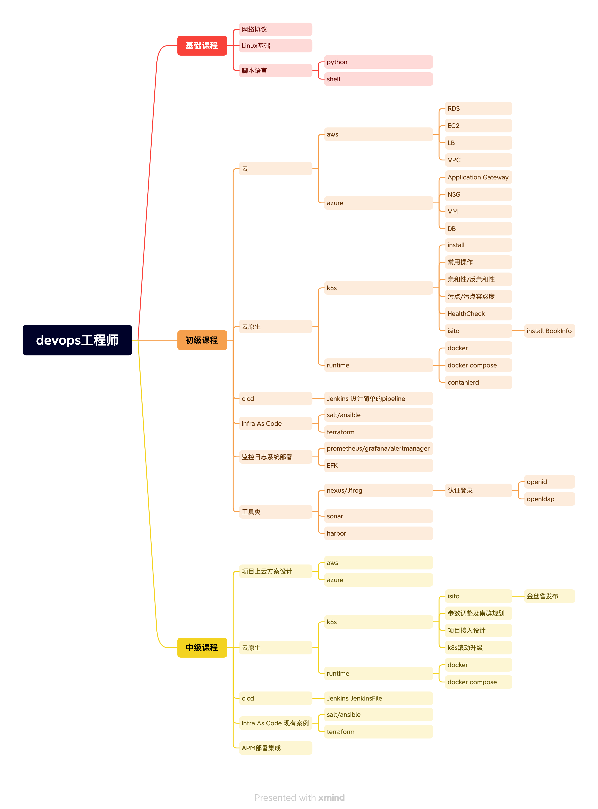

# Devops

## 什么是Devops?

当今软件开发的复杂性和变化速度很高，而传统的软件开发方法可能无法满足这些需求。DevOps是一种将软件开发和运维紧密结合的哲学和实践，旨在通过自动化、协作和持续反馈来提高软件开发和部署的效率和质量。DevOps工程师是专门从事DevOps实践的软件开发人员或运维人员，他们具备跨领域的技能和知识，能够在软件开发、测试、部署和运维等各个阶段中使用自动化工具和流程来加速软件交付，提高运行效率和稳定性，并持续推动团队的改进和创新。DevOps工程师需要具备良好的沟通协作能力、强大的技术能力和持续学习的意识，以应对日益复杂和多变的软件开发和运维挑战。

## Devops日常工作内容

1. 自动化部署和运维：使用自动化工具和流程来管理、部署和监控软件应用，以提高效率和稳定性。
2. 持续集成和持续交付：设计和实现持续集成和持续交付的流程，确保软件开发和交付的快速、高效和质量。
3. 监控和故障排除：使用各种监控工具和技术来监控系统和应用的运行状态，及时发现和解决故障。
4. 安全与合规性：关注系统和应用的安全和合规性风险，采取措施来确保系统和应用的安全和合规性。
5. 团队协作和沟通：与开发团队、测试团队紧密协作，促进项目的顺利进行。
6. 持续改进和创新：不断学习和尝试新的技术和工具，推动团队的持续改进和创新，提高软件开发和运维的效率和质量

## Devops学习路径

