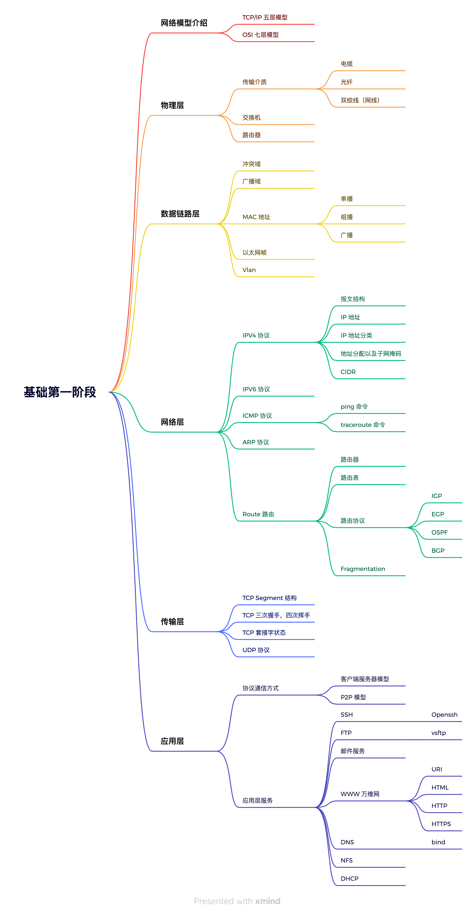

# 网络基础

在我们日常工作、学习、生活中，会经常通过手机、电脑等可视化设备在网络上搜索各种各样的信息，购物、聊天、刷视频、浏览网站等等，那么即将成为 Devops 工程师的我们，是否想过我们在终端设备上的点击、搜索等操作，终端设备是如何将我们想要的信息反回给我们的吗？通过本阶段学习，能够帮助你了解数据传输的过程。

计算机网络基础是 Devops 知识体系中最基础，也是必须要掌握的技能之一，网络知识体系庞大且深邃，很难将其研究的十分透彻。不过我们并不是专业的网络工作者，我们只需要掌握作为一名 Devops 工程师日常学习新技能或处理问题能够涉及到的部分知识即可。下面让我们在第一阶段来学习一些网络的基础知识，为后面的学习打下基础。

## 知识体系结构

