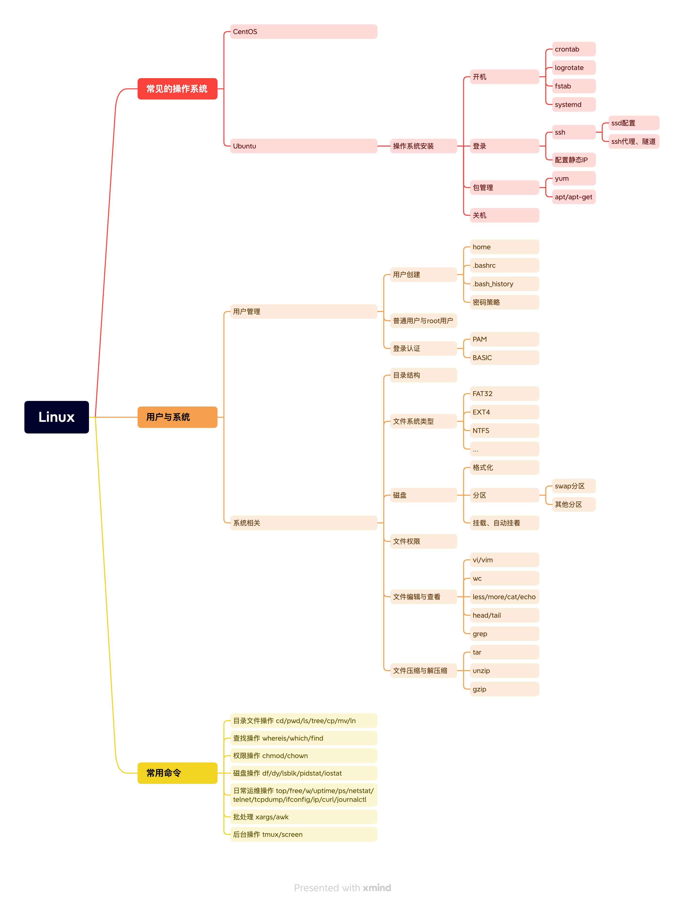

# 操作系统
* 了解Linux的历史，知道Linux的常见操作系统。
* 可以在自己电脑上安装使用自己的第一台Ubuntu虚机
* 对Linux有个大体上的了解

## 资料

* [鸟哥的Linux私房菜](https://tiramisutes.github.io/images/PDF/vbird-linux-basic-4e.pdf) 
* [Linux基础](https://linuxtools-rst.readthedocs.io/zh_CN/latest/base/index.html)
* [shell语句解析](https://explainshell.com/)
* [Linux历史](https://zh.wikipedia.org/wiki/Linux%E5%8E%86%E5%8F%B2 )
* [Linux](https://zh.wikipedia.org/wiki/Linux)

## 知识体系结构

