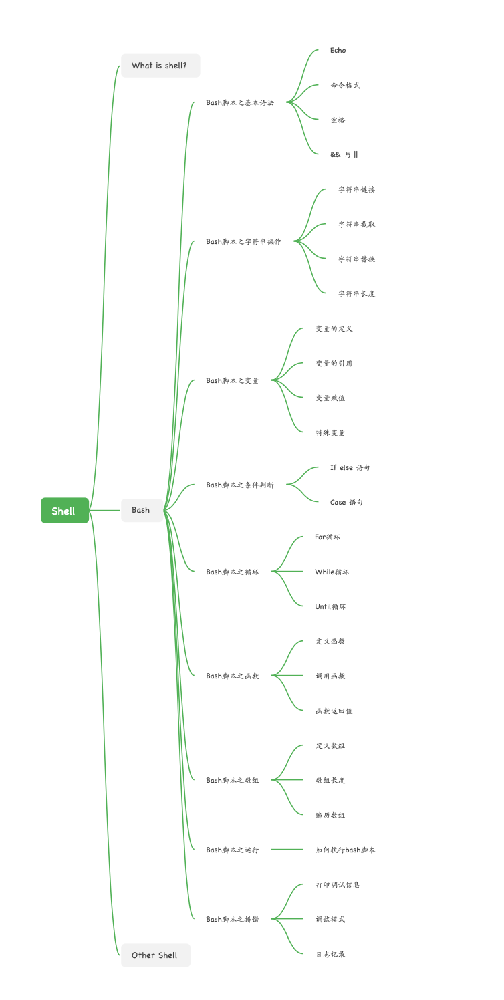

# Shell
* 了解什么是shell, linux下有哪几种shell, 常用的shell是那种
* 掌握shell脚本基本语法, 变量, 字符串操作, 函数, 条件判断, 循环
* 知道shell脚本如何运行和排错
* 可以用bash shell写简单的运维脚本

## Shell 的含义

学习 Bash，首先需要理解 Shell 是什么。Shell 这个单词的原意是“外壳”，跟 kernel（内核）相对应，比喻内核外面的一层，即用户跟内核交互的对话界面。

具体来说，Shell 这个词有多种含义。

首先，Shell 是一个程序，提供一个与用户对话的环境。这个环境只有一个命令提示符，让用户从键盘输入命令，所以又称为命令行环境（command line interface，简写为 CLI）。Shell 接收到用户输入的命令，将命令送入操作系统执行，并将结果返回给用户。本书中，除非特别指明，Shell 指的就是命令行环境。

其次，Shell 是一个命令解释器，解释用户输入的命令。它支持变量、条件判断、循环操作等语法，所以用户可以用 Shell 命令写出各种小程序，又称为脚本（script）。这些脚本都通过 Shell 的解释执行，而不通过编译。

最后，Shell 是一个工具箱，提供了各种小工具，供用户方便地使用操作系统的功能。

## Shell 的种类

Shell 有很多种，只要能给用户提供命令行环境的程序，都可以看作是 Shell。

历史上，主要的 Shell 有下面这些。

Bourne Shell（sh）
Bourne Again shell（bash）
C Shell（csh）
TENEX C Shell（tcsh）
Korn shell（ksh）
Z Shell（zsh）
Friendly Interactive Shell（fish）

**Bash 是目前最常用的 Shell，除非特别指明，下文的 Shell 和 Bash 当作同义词使用，可以互换.**

## 知识体系结构

## 资料

[Bash脚本教程](https://wangdoc.com/bash/intro)
