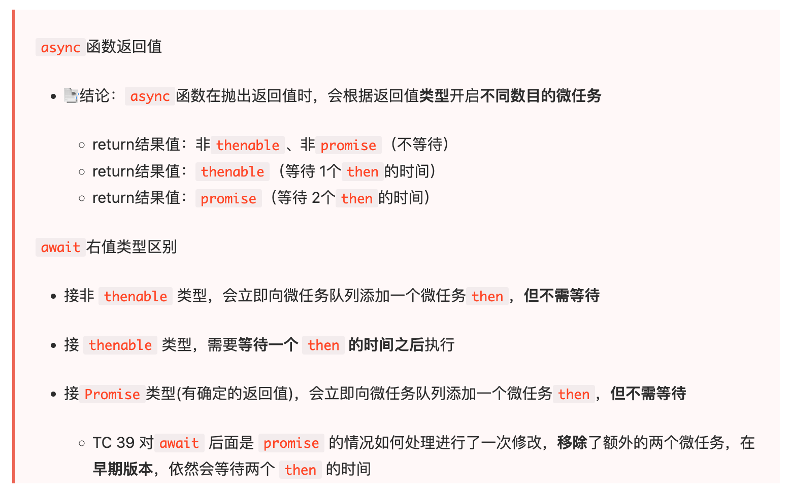

# JS执行机制/Event Loop

> 事件循环（Event Loop）是一种浏览器或运行时环境（如 Node.js）中用于处理异步操作的机制。它是实现并发和异步编程的基础，允许程序在等待某些操作完成时继续执行其他任务，而不会阻塞整个进程。

### 知识巩固, 建议先看 ⭐ 

* [JS 运行机制最全面的一次梳理](https://mp.weixin.qq.com/s/4-ksInVAJxGxBhEjogTjMw)

**首先**, 事件循环是**宿主环境**的, 不应该说是**JS**的.

1. [掘金: JS的执行顺序](https://juejin.cn/post/7076709794286927909)
2. [掘金: async/await 原理及执行顺序分析](https://juejin.cn/post/6844903988584775693)
3. [掘金: [译] 理解 JavaScript 中的执行上下文和执行栈](https://juejin.cn/post/6844903682283143181)

重点推荐:

4. [Github: 第 10 题：常见异步笔试题，请写出代码的运行结果](https://github.com/Advanced-Frontend/Daily-Interview-Question/issues/7)
5. [知乎:promise.then 中 return Promise.resolve 后，发生了什么？](https://www.zhihu.com/question/453677175/answer/1841325386)
6. [知乎: 为啥resolved 是在 promise2之后输出](https://www.zhihu.com/question/430549238)

练习:
* [10 个关于 Promise 和 setTimeout 知识的面试题，通过图解一次说透彻](https://mp.weixin.qq.com/s/8U2mAvVo-44Epqq1enmBcQ)

总结: 
**Event Loop**(参考链接1+链接4):
1. 首先顺序执行同步任务(包括Promise中的同步代码), 将异步任务放入`微任务队列`或`宏任务队列`
2. 顺序执行步骤1中产生的微任务, 清空`微任务队列`; 如果执行过程中遇到新的微任务, 追加在 `当前` 微任务队列末尾; 如果遇到新的宏任务, 追加到步骤1中的宏任务队列末尾
3. 顺序执行步骤1中产生的宏任务, 执行完 `一个` 宏任务后, 就需要去执行并清空微任务队列
4. 按照步骤3的原则, 重复执行宏任务队列中的任务, 清空为止

**注意**: 
* `await右侧的表达式会先执行一遍, 将await后面的代码加入到微任务队列中，然后就会跳出整个async函数来执行后面的代码。(链接1+链接4)`  
* ~~如果 `await右侧的表达式` 执行中存在异步, 那么await后面的代码不会立即加入到微任务队列, 而是跳出这个async函数, 等其他代码执行完毕后再回到async, 将await后面的代码加入微任务队列~~(链接2中有这个说法, 但是不正确)
* resolve 的参数为 Promise 时，要额外消耗两个 microtask(参考链接5+链接6, 涉及V8源码实现)
* [你不知道的 async、await 魔鬼细节](https://juejin.cn/post/7194744938276323384#comment) ⭐ 

