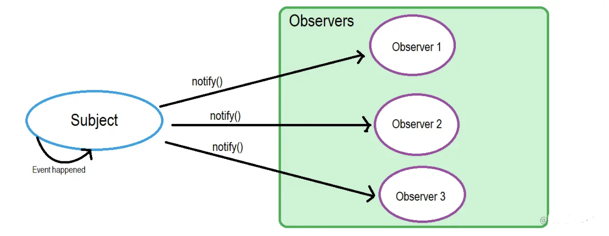

# 发布订阅模式和观察者模式

## 观察者模式

观察者模式定义了对象间的一对多的依赖关系，当一个对象的状态发生改变时，所有依赖于它的对象都将得到通知，并自动更新

观察者模式属于行为型模式，行为型模式关注的是对象之间的通讯，观察者模式就是观察者和被观察者之间的通讯


`Observers` 代表所有的观察者, `subject` 代表被观察的原对象(被观察者)

例如生活中，我们可以用报纸期刊的订阅来形象的说明，当你订阅了一份报纸，每天都会有一份最新的报纸送到你手上，有多少人订阅报纸，报社就会发多少份报纸, 报社和订报纸的客户就形成了一对多的依赖关系

### 实现

被观察者:

```js
class Subject {
  constructor() {
    this.observerList = [];
  }

  addObserver(observer) {
    this.observerList.push(observer);
  }

  removeObserver(observer) {
    const idx = this.observerList.findIndex(o => o.name === observer.name);
    this.observerList.splice(idx, 1);
  }
  // 通知所有的观察者 Observer
  notifyObservers(message) {
    this.observerList.forEach(observer => observer.notified(message));
  }
}
```

观察者:

```js
class Observer {
  constructor(name, subject) {
    this.name = name;
    if (subject) {
      subject.addObserver(this);
    }
  }

  notified(message) {
    console.log(this.name, 'got message', message);
  }
}
```

使用示例:

```js
// subject 作为被观察者
const subject = new Subject();
// observerA 作为观察者, 并订阅 subject, 加入到观察者列表中
const observerA = new Observer('observerA', subject);
// observerB 作为观察者, 没有订阅 subject
const observerB = new Observer('observerB');

// subject 主动将observerB加入到观察者列表中
subject.addObserver(observerB);
// subject 主动通知所有的观察者
subject.notifyObservers('Hello from subject');
// subject 主动将observerA从观察者列表中移除
subject.removeObserver(observerA);
// subject 再次主动通知所有的观察者
subject.notifyObservers('Hello again');
```

输出如下

```json
observerA got message Hello from subject
observerB got message Hello from subject
observerB got message Hello again
```

上述代码中，观察者主动申请加入被观察者的列表，被观察者主动将观察者加入列表

## 发布订阅模式

发布-订阅是一种消息范式，消息的发送者（称为发布者 `publisher` ）不会将消息直接发送给接收者（称为订阅者 `subscriber` ）。而是将发布的消息分为不同的类别，无需了解存在了哪些订阅者

同样的，订阅者可以表达对一个或多个类别的兴趣，只接收感兴趣的消息，无需了解哪些发布者存在

如何交流呢? 是通过第三者，也就是在消息队列里面，我们常说的经纪人(订阅中心) `Broker`


发布者只需告诉Broker，我要发的消息，topic是AAA；

订阅者只需告诉Broker，我要订阅topic是AAA的消息；

于是，当Broker收到发布者发过来消息，并且topic是AAA时，就会把消息推送给订阅了topic是AAA的订阅者。

### 实现

```js
class Broker {
  constructor() {
    this.messages = {};
    this.listeners = {};
  }

  // 添加发布者
  publish(type, content) {
    const existContent = this.messages[type];
    if (!existContent) {
      this.messages[type] = [];
    }
    this.messages[type].push(content);
  }

  // 添加订阅者
  subscribe(type, cb) {
    const existListener = this.listeners[type];
    if (!existListener) {
      this.listeners[type] = [];
    }
    this.listeners[type].push(cb);
  }

  // 通知
  notify(type) {
    const messages = this.messages[type];
    const subscribers = this.listeners[type] || [];
    subscribers.forEach((cb, index) => cb(messages[index]));
  }
}

class Publisher {
  constructor(name, context) {
    this.name = name;
    this.context = context;
  }
  publish(type, content) {
    this.context.publish(type, content);
  }
}

class Subscriber {
  constructor(name, context) {
    this.name = name;
    this.context = context;
  }
  subscribe(type, cb) {
    this.context.subscribe(type, cb);
  }
}
```

使用方式:

```js
const TYPE_A = "music";
const TYPE_B = "movie";
const TYPE_C = "novel";
// 订阅中心
const pubsub = new Broker();
// 发布者初始化并publish消息
const publisherA = new Publisher("publisherA", pubsub);
publisherA.publish(TYPE_A, "we are young");
publisherA.publish(TYPE_B, "the silicon valley");

const publisherB = new Publisher("publisherB", pubsub);
publisherB.publish(TYPE_A, "stronger");

const publisherC = new Publisher("publisherC", pubsub);
publisherC.publish(TYPE_C, "a brief history of time");

// 订阅者初始化并订阅消息
const subscriberA = new Subscriber("subscriberA", pubsub);
subscriberA.subscribe(TYPE_A, (res) => {
  console.log("subscriberA received:", res);
});
const subscriberB = new Subscriber("subscriberB", pubsub);
subscriberB.subscribe(TYPE_C, (res) => {
  console.log("subscriberB received:", res);
});
const subscriberC = new Subscriber("subscriberC", pubsub);
subscriberC.subscribe(TYPE_B, (res) => {
  console.log("subscriberC received:", res);
});

// 订阅中心通知消息给订阅者
pubsub.notify(TYPE_A);
pubsub.notify(TYPE_B);
pubsub.notify(TYPE_C);
```

输出如下:

```json
subscriberA received: we are young
subscriberC received: the silicon valley
subscriberB received: a brief history of time
```

上述代码，发布者和订阅者需要通过发布订阅中心进行关联，发布者的发布动作和订阅者的订阅动作相互独立，无需关注对方，消息派发由发布订阅中心负责

## 区别

从表面上看：
* 观察者模式里，只有两个角色: `观察者 Observers` + `被观察者 subject`
* 发布订阅模式里，却不仅有`发布者 publisher` 和 `订阅者 subscriber`两个角色，还有`经纪人(订阅中心) Broker`

往更深层次讲：

* 观察者和被观察者，是松耦合的关系
* 发布者和订阅者，则完全不存在耦合

从使用层面上讲：

* 观察者模式，多用于单个应用内部
* 发布订阅模式，则更多的是一种跨应用的模式(cross-application pattern)，比如我们常用的消息中间件

## 参考链接

* https://zhuanlan.zhihu.com/p/51357583
* https://vue3js.cn/interview/design/Observer%20%20Pattern.html#%E4%B8%80%E3%80%81%E8%A7%82%E5%AF%9F%E8%80%85%E6%A8%A1%E5%BC%8F
