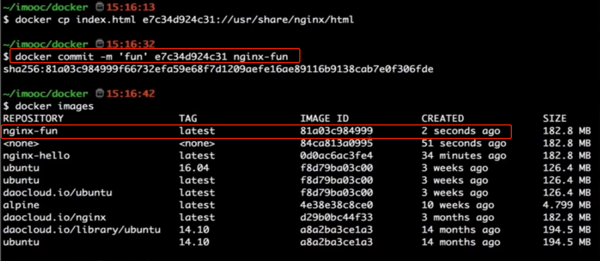

# Docker
* [前端工程师也应该了解的docker](https://juejin.cn/post/7250029395023544376?utm_source=gold_browser_extension#heading-6)
* [阿里云的部署并使用docker简易教程](https://help.aliyun.com/document_detail/2341651.html?spm=5176.28008736.J_6443120770.d938380_1.7d6a3e4d0SrgFc&pipCode=savingplan&goodsId=938380&scm=20140722.M_938380._.V_1)
* [imooc docker例子](https://www.imooc.com/video/15646)

## 基础命令

* 查看已经安装的镜像
  > `docker images`

* 查看正在运行的`container`, 查看所有`container`添加 `-a`
  > `docker ps`

* 终止某个`container`
  > `docker stop <containerId 或 name>`

* 启动某个`container`
  > `docker start <containerId 或 name>`

* 删除某个`container`
  > `docker  rm <containerId 或 name>`

* 删除一个 `image`
  > `docker rmi <imageId>`

## 运行 `nginx`

> `docker run --name nginx-alias-pccc -p 80:80 -d nginx`

其中, `--name` 后的参数为 `container` 别名(nginx-alias-pccc), 可以在停止/启动的时候使用别名, `-p` 表示开启端口映射, `:` 前的端口为本机的端口, 其后的为 docker 中的端口, `-d` 表示后台运行, `nginx` 为镜像名称

> `docker cp index.html nginx-alias-pccc://usr/share/nginx/html`

拷贝当前目录下的 `index.html` 文件到容器 `nginx-alias-pccc` 的 `nginx` 的 `html` 目录, 可以达到更新网站内容的目的

> `docker commit -m 'commit message' <containerId> <imageName>`

基于一个存在的容器, 保存变更成为一个新的镜像

