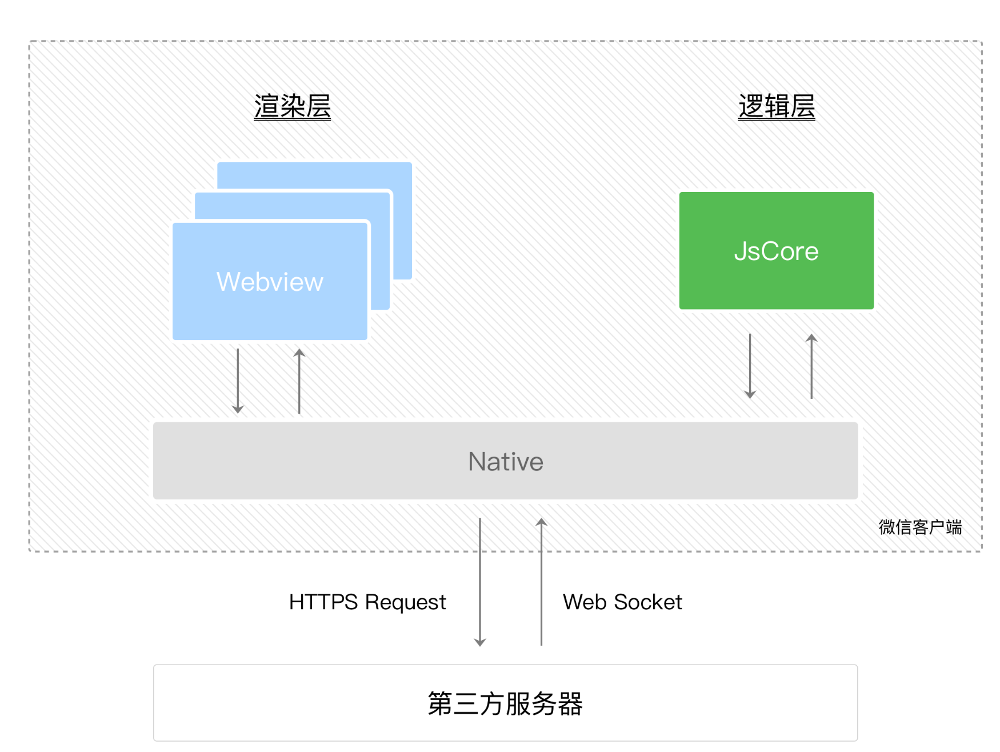

# 一些其他的内容

## 在参与antd贡献的时候, 你做了什么

1. 参与大版本V4->V5的组件开发, antd 在升级的过程中做了很多技术调整, 主要的在于动态主题方面: **弃用 less，采用 CSS-in-JS，更好地支持动态主题, 底层使用 @ant-design/cssinjs 作为解决方案。**, 使用新的 `design token` 概念来帮助处理样式。 参考官网的[定制主题](https://ant.design/docs/react/customize-theme-cn)
  > antd V5 发布说明: https://www.yuque.com/ant-design/ant-design/cy5nfvdo8oidvwmz

  > 过去我们尝试通过 CSS Variables 提供动态主题能力。在经过一段时间的探索后，我们发现随着设计系统的复杂度提升，其中间变量的维护成本就会变得不可忽略。因而在 v4 时期，CSS Variables 停留在了动态主题色而没有进一步提供暗色、其他 Token 的动态能力。到了 v5，随着灵活性的需求呼之欲出，我们不得不再次面对动态主题的问题。

  > 在 v5 启动伊始，我们花了几个月的时间对比当下流行的动态主题方案：CSS Variables 与 CSS-in-JS。CSS-in-JS 不需要维护中间变量，但是有更多的运行时消耗（如果你对此不太熟悉，欢迎阅读 Why We're Breaking Up with CSS-in-JS）。从维护成本而言，我们更倾向于后者，但是我们并不希望因此而损害用户体验。因而在经过一系列尝试后，我们研发了一套针对组件级别的 CSS-in-JS 库 @ant-design/cssinjs。它通过牺牲动态性来获取更高的缓存效率，从而减少运行时的性能损耗。

2. 参与了多个组件的样式从 `less` 到 `css-in-js`的重构 例如: `steps` `layout` `notification`, 并且将属性切换为逻辑属性, 更好的支持 LTR/RTL
3. 参与了一些组件的功能开发和bug修复, 例如 `image-preview`
4. 参与V5官网的修改和适配
6. 可以描述cssinjs的一些问题, 参考: https://dev.to/srmagura/why-were-breaking-up-wiht-css-in-js-4g9b
  > 优点: 组件局部样式/统一的代码组织方式(css和JS放在一起)/可以在样式中使用JS变量

  > 缺点: CSS-in-JS 增加了运行时开销(这是重点, 也是antd团队自研@ant-design/cssinjs的原因)。当您的组件呈现时，CSS-in-JS 库必须将您的样式“序列化”为可以插入到文档中的纯 CSS; 增加了包的大小; React DevTools 变得混乱

一些其他的看法:
* 5.12.0 起，Ant Design 5.x 重新支持了 CSS 变量。与 4.x 版本不同的是，这次我们融合了 CSS-in-JS 的能力，并且将所有 Design Token 纳入了 CSS 变量的管理范畴
* 将 momentJS 替换为 dayjs
* API调整等其他内容

## 星巴克项目中的框架级别适配, 具体是什么?

### 背景

星巴克app的项目中, 关于星星记录(用户的消费产生的星星, 用于升级和兑换), 使用到了一个动画特效, 这个动画特效以前是Android和iOS分别实现, 然后h5分享页有一个简易版本, 在新阶段的代号 `all star`的业务优化中, 需要将整个页面重构为h5, 并添加新的内容和交互, 这个库采用的是 matter-js(一个2D物理引擎库)

这个库在 web 上正常运行, 但是因为业务上需要兼容到小程序, 框架本身不支持需要做适配; 当然在走这个方案之前我还罗列了其他的方案: 例如, 使用webview 但是受制于小程序中webview的限制, 我们的页面不是常规的webview常应用的场景: 用户协议等静态页面, 最终还是摒弃了这种方案

### 如何适配

1. 需要分析 小程序运行环境和普通web, h5运行环境上的差异
2. 添加补丁, eg: 循环轮询的方式, RAF->setTimeout的剑姬
3. 补充一些全局缺失的环境, 例如 new Image
4. 处理不同设备 android/ios上 事件的属性兼容

#### 步骤1的解释: 小程序与网页开发区别

[原文链接](https://developers.weixin.qq.com/miniprogram/dev/framework/quickstart/#%E5%B0%8F%E7%A8%8B%E5%BA%8F%E4%B8%8E%E6%99%AE%E9%80%9A%E7%BD%91%E9%A1%B5%E5%BC%80%E5%8F%91%E7%9A%84%E5%8C%BA%E5%88%AB)

小程序的主要开发语言是 JavaScript ，小程序的开发同普通的网页开发相比有很大的相似性。对于前端开发者而言，从网页开发迁移到小程序的开发成本并不高，但是二者还是有些许区别的。

​网页开发渲染线程和脚本线程是互斥的，这也是为什么长时间的脚本运行可能会导致页面失去响应，而在小程序中，二者是分开的，分别运行在不同的线程中。网页开发者可以使用到各种浏览器暴露出来的 DOM API，进行 DOM 选中和操作。而如上文所述，**小程序的逻辑层和渲染层是分开的，逻辑层运行在 JSCore 中，并没有一个完整浏览器对象，因而缺少相关的DOM API和BOM API**。这一区别导致了前端开发非常熟悉的一些库，例如 jQuery、 Zepto 等，在小程序中是无法运行的。同时 JSCore 的环境同 NodeJS 环境也是不尽相同，所以一些 NPM 的包在小程序中也是无法运行的。

​网页开发者需要面对的环境是各式各样的浏览器，PC 端需要面对 IE、Chrome、QQ浏览器等，在移动端需要面对Safari、Chrome以及 iOS、Android 系统中的各式 WebView 。而小程序开发过程中需要面对的是两大操作系统 iOS 和 Android 的微信客户端，以及用于辅助开发的小程序开发者工具，小程序中三大运行环境也是有所区别的。
| 运行环境       | 逻辑层          | 渲染层              |
| -------------- | --------------- | ------------------- |
| iOS            | JavaScriptCore  | WKWebView           |
| 安卓           | V8              | chromium定制内核    |
| 小程序开发者工具 | NWJS            | Chrome WebView      |

#### 小程序宿主环境, 渲染层和逻辑层

[原文链接](https://developers.weixin.qq.com/miniprogram/dev/framework/quickstart/framework.html#%E6%B8%B2%E6%9F%93%E5%B1%82%E5%92%8C%E9%80%BB%E8%BE%91%E5%B1%82)
小程序的运行环境分成渲染层和逻辑层，其中 WXML 模板和 WXSS 样式工作在渲染层，JS 脚本工作在逻辑层。

小程序的渲染层和逻辑层分别由2个线程管理：渲染层的界面使用了WebView 进行渲染；逻辑层采用JsCore线程运行JS脚本。一个小程序存在多个界面，所以渲染层存在多个WebView线程，这两个线程的通信会经由微信客户端（下文中也会采用Native来代指微信客户端）做中转，逻辑层发送网络请求也经由Native转发，小程序的通信模型下图所示。

## OPPO 项目上的vue2+DSL?

* 借助作用于插槽, 封装类似于useRequest这种的hooks, 减少一些重复变量, 帮助完成请求(代价就是引入一个没有UI渲染的逻辑性组件)
* 抽象出新的标签 `node` 搭配一些嵌套和属性, 来代替项目中的组件使用, 减少他们的重复引入和状态管理, 原理是使用vue2的`h`函数, 自己创建组件
* 臭氧出各种的组件

### 资料

* [vue2 h 渲染函数](https://v2.cn.vuejs.org/v2/guide/render-function.html#JSX)
<!-- * [vue2 渲染机制](https://cn.vuejs.org/guide/extras/rendering-mechanism.html) -->
