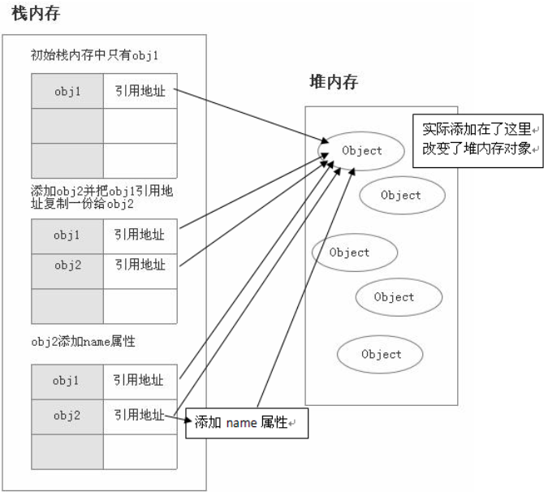

# 基础

## 1. JS 中有哪些数据类型?

JS 有如下 7 种基本类型 + 1 种引用类型(`Object`)
| 类型 | typeof 返回值 | 对象包装器 |
| ------------- | ----------- | ---- |
|Null| "object" | N/A |
|Undefined| "undefined" | N/A |
|Boolean| "boolean" | Boolean |
|Number| "number" | Number |
|BigInt| "bigint" | BigInt |
|String| "string" | String |
|Symbol| "symbol" | Symbol |

## 2. 基本类型和引用类型存储上的区别?

基本数据类型和引用数据类型存储在内存中的位置不同：

- 基本数据类型存储在栈中

- 引用类型的对象存储于堆中

当我们把变量赋值给一个变量时，解析器首先要确认的就是这个值是基本类型值还是引用类型值

### 基本类型

```js
let a = 10;
let b = a; // 赋值操作
b = 20;
console.log(a); // 10值
```

`a` 的值为一个基本类型，是存储在栈中，将 `a` 的值赋给 `b`，虽然两个变量的值相等，但是两个变量保存了两个不同的内存地址

下图演示了基本类型赋值的过程：


### 引用类型

```js
var obj1 = {};
var obj2 = obj1;
obj2.name = 'Xxx';
console.log(obj1.name); // xxx
```

引用类型数据存放在堆中，每个堆内存对象都有对应的引用地址指向它，引用地址存放在栈中。

`obj1` 是一个引用类型，在赋值操作过程汇总，实际是将堆内存对象在栈内存的引用地址复制了一份给了 `obj2`，实际上他们共同指向了同一个堆内存对象，所以更改 `obj2` 会对 `obj1` 产生影响

下图演示这个引用类型赋值过程



### 参考链接

- [MDN JS 类型和数据结构](https://developer.mozilla.org/zh-CN/docs/Web/JavaScript/Data_structures#%E5%8A%A8%E6%80%81%E5%92%8C%E5%BC%B1%E7%B1%BB%E5%9E%8B)
- [数据类型和存储的区别](https://vue3js.cn/interview/JavaScript/data_type.html#%E5%89%8D%E8%A8%80)

## 3. typeof 与 instanceof 区别

### typeof

typeof 是一个操作符，用于检查给定值的数据类型。 返回值为 string

| 类型         | 结果                     |
| ------------ | ------------------------ |
| Undefined    | "undefined"              |
| Null         | "object"（历史遗留原因） |
| Boolean      | "boolean"                |
| Number       | "number"                 |
| BigInt       | "bigint"                 |
| String       | "string"                 |
| Symbol       | "symbol"                 |
| Function     | "function"               |
| 其他任何对象 | "object"                 |

### instanceof

instanceof 是一个运算符，用于检查**实例对象**的原型链中是否存在指定的构造函数。返回值为 boolean

```js
object instanceof constructor;
// object 为实例对象，constructor 为构造函数
```

构造函数通过 new 可以实例对象，instanceof 能判断这个对象是否是之前那个构造函数生成的对象

```js
// 定义构建函数
let Car = function () {};
let benz = new Car();
benz instanceof Car; // true

let car = new String('xxx');
car instanceof String; // true

let str = 'xxx';
str instanceof String; // false
```

#### instanceof 模拟实现 ⭐️

也就是顺着原型链去找，直到找到相同的原型对象，返回 true，否则为 false

```js
function myInstanceof(left, right) {
  // 这里先用 typeof 来判断基础数据类型，如果是，直接返回 false
  if (typeof left !== 'object' || left === null) return false;
  // getPrototypeOf 是 Object 对象自带的 API，能够拿到参数的原型对象
  let proto = Object.getPrototypeOf(left);
  while (true) {
    if (proto === null) return false;
    if (proto === right.prototype) return true; //找到相同原型对象，返回 true
    proto = Object.getPrototypeOf(proto);
  }
}
```

### 区别

- typeof 用于检查值的数据类型，特别适用于基本数据类型和函数的检查。
- instanceof 用于检查对象的原型链中的构造函数，用于自定义对象的类型检查。

### 参考链接

- [MDN typeof](https://developer.mozilla.org/zh-CN/docs/Web/JavaScript/Reference/Operators/typeof)
- [MDN instanceof](https://developer.mozilla.org/zh-CN/docs/Web/JavaScript/Reference/Operators/instanceof)
