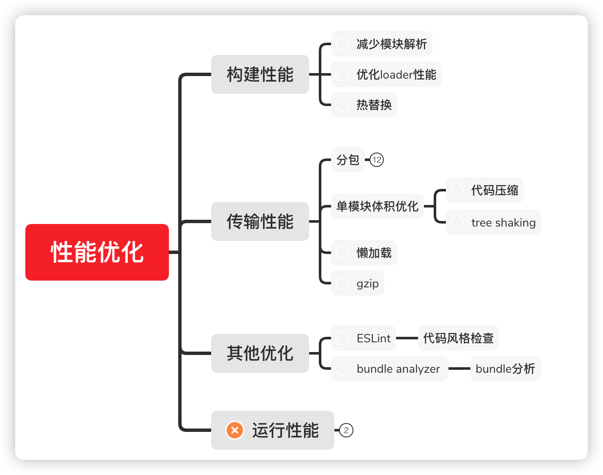

# 性能优化

性能优化主要体现在三个方面：

1. **构建性能**

这里所说的构建性能，是指在**开发阶段的构建性能**，而不是生产环境的构建性能

优化的目标，**是降低从打包开始，到代码效果呈现所经过的时间**

构建性能会影响开发效率。构建性能越高，开发过程中时间的浪费越少 

2. **网络传输性能**

传输性能是指，打包后的JS代码传输到浏览器经过的时间, 在优化传输性能时要考虑到：

1. 总传输量：所有需要传输的JS文件的内容加起来，就是总传输量，重复代码越少，总传输量越少
2. 文件数量：当访问页面时，需要传输的JS文件数量，文件数量越多，http请求越多，响应速度越慢
3. 浏览器缓存：JS文件会被浏览器缓存，被缓存的文件不会再进行传输

3. **运行性能** 代码层面

运行性能是指，JS代码在浏览器端的运行速度, 它主要取决于我们如何书写高性能的代码

**永远不要过早的关注于性能**，因为你在开发的时候，无法完全预知最终的运行性能，过早的关注性能会极大的降低开发效率

推荐回答: [🌟 面试遇到性能优化问题回答这 9 点，绝对加分！](https://mp.weixin.qq.com/s/fteB8JEGbBwrOtmYVzJQzQ)

## 列举优化网络性能方法

:::details 参考答案
* 优化打包体积

  利用一些工具压缩、混淆最终打包代码，减少包体积

* 多目标打包

  利用一些打包插件，针对不同的浏览器打包出不同的兼容性版本，这样一来，每个版本中的兼容性代码就会大大减少，从而减少包体积

* 压缩

  现代浏览器普遍支持压缩格式，因此服务端的各种文件可以压缩后再响应给客户端，只要解压时间小于优化的传输时间，压缩就是可行的

* CDN

  利用 CDN 可以大幅缩减静态资源的访问时间，特别是对于公共库的访问，可以使用知名的 CDN 资源，这样可以实现跨越站点的缓存

* 缓存

  对于除 HTML 外的所有静态资源均可以开启协商缓存，利用构建工具打包产生的文件 hash 值来置换缓存

* http2

  开启 http2 后，利用其多路复用、头部压缩等特点，充分利用带宽传递大量的文件数据

* 雪碧图

  对于不使用 HTTP2 的场景，可以将多个图片合并为雪碧图，以达到减少文件的目的

* defer、async

  通过 defer 和 async 属性，可以让页面尽早加载 js 文件

* prefetch、preload

  通过 prefetch 属性，可以让页面在空闲时预先下载其他页面可能要用到的资源

  通过 preload 属性，可以让页面预先下载本页面可能要用到的资源

* 多个静态资源域

  对于不使用 HTTP2 的场景，将相对独立的静态资源分到多个域中保存，可以让浏览器同时开启多个 TCP 连接，并行下载

:::

## 文章

* [使用 Preload/Prefetch 优化你的应用](https://zhuanlan.zhihu.com/p/48521680)
* [Preload Prefetch Preconnect](https://juejin.cn/post/7274889579076108348)
* [浏览器Transfer Size vs. Resource Size异同](https://www.webperf.tips/tip/resource-size-vs-transfer-size/)
* [Web Performance Tips ⚡](https://www.webperf.tips/)
* [不一样的"代码拆分"+"预加载"实现应用性能及体验兼得](https://mp.weixin.qq.com/s/KWYJjqwAxtOLZNnMN6J_-g)
   > 把动态加载改造为预加载, 减少组件加载过程的耗时
* [3.40秒到231.84毫秒，我用Performance面板分析性能瓶颈全流程](https://mp.weixin.qq.com/s/ONdNyvaL1Uo-iSNN3F-R6w)

## Speed Insights 度量指标

* [First Contentful Paint 首次内容绘制 (FCP)](https://web.dev/fcp/#%E4%BB%80%E4%B9%88%E6%98%AF-fcp%EF%BC%9F)
* [Largest Contentful Paint 最大内容绘制 (LCP)](https://web.dev/lcp/)
* [Cumulative Layout Shift 累积布局偏移 (CLS)](https://web.dev/cls/)
* [First Input Delay 首次输入延迟 (FID)](https://web.dev/fid/)
* [Interaction to Next Paint (INP)](https://web.dev/inp/)

## SWR

[2023 年了，你为什么还不用 SWR ？](https://mp.weixin.qq.com/s/4DtegEuQ0I7b4FvKxGcMlQ)

## 其他

* [Chrome devtool 官方文档](https://developer.chrome.com/docs/devtools/#uncompressed)
* [面试被问了几百遍的 QPS、TPS、RT ！你还傻傻搞不清楚](https://mp.weixin.qq.com/s/wfHFY5vyqpAPY4e8TvzRFQ)
