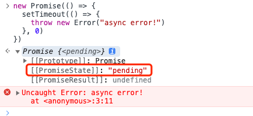

# 手写 promise 基本构造器

## 本章节代码

```js:line-numbers {12,25,41-42}
const PENDING = 'pending';
const FULFILLED = 'fulfilled';
const REJECTED = 'rejected';

class MyPromise {
  /**
   * 创建一个 promise
   * executor 类比 new promise((res, rej)=>{}) 中的 (res, rej)=>{}
   * @param {Function} executor 任务执行器, 立即执行
   */
  constructor(executor) {
    // 注意只能捕获同步错误 (ES6 的 Promise 也是如此)
    try {
      executor(this.#resolve, this.#reject);
    } catch (error) {
      // 执行期间报错
      this.#reject(error);
    }
  }

  #state = PENDING; // 状态
  #result = undefined; // 数据

  /**
   * 标记当前任务完成 注意 this 绑定, 这里使用箭头函数, 下同
   * @param {any} data 任务完成的相关数据
   */
  #resolve = (data) => {
    this.#changeState(FULFILLED, data);
  };
  /**
   * 标记当前任务失败
   * @param {any} reason 任务失败的相关数据
   */
  #reject = (reason) => {
    this.#changeState(REJECTED, reason);
  };

  // 改变状态和数据
  #changeState(state, result) {
    // 状态如果已经更改, 不再执行
    if (this.#state !== PENDING) return;
    this.#state = state;
    this.#result = result;
    console.log('promise状态:', this.#state);
    console.log('promise结果:', this.#result);
  }
}
```

## 测试用例

### resolved

```js
new MyPromise((res, rej) => {
  res('我是 resolve');
});

// promise状态: fulfilled
// promise结果: 我是 resolve
```

### rejected

```js
new MyPromise((res, rej) => {
  res('我是 reject');
});

// promise状态: rejected
// promise结果: 我是 reject
```

### 既有 resolve 也有 reject

```js
new MyPromise((res, rej) => {
  res('我是 resolve');
  rej('我是 reject');
});

// promise状态: fulfilled
// promise结果: 我是 resolve
```

### 同步错误

```js
new MyPromise((res, rej) => {
  throw new TypeError('null!!!');
});

// promise状态: rejected
// promise结果: TypeError: null!!!
// ....
```

### 异步错误

```js
new MyPromise((res, rej) => {
  setTimeout(() => {
    throw new Error('async error!');
  }, 0);
});
// /Users/pczheng/Work_Temp/promise 手写.js:52
//     throw new Error('async error!')
//     ^

// Error: async error!
//   at Timeout._onTimeout (/Users/pczheng/Work_Temp/promise 手写.js:52:11)
//   at listOnTimeout (internal/timers.js:557:17)
//   at processTimers (internal/timers.js:500:7)
```

`ES6` 中 `promise` 异步错误的表现

