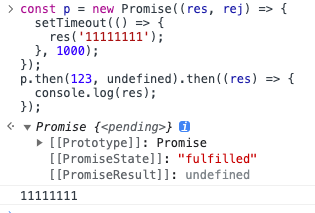

# 手写 promise-then 的返回值

本章节主要处理 `.then` 回调

## .then 的回调不是函数

在 `promise` 中如果 `.then` 的回调不是函数, 例如 `123`, `null`, 会直接延用原 promise 的状态和数据

`ES6 Promise` 表现如下:



代码处理

```js
  // then 中的函数处理
#run() {
  if (this.#state === PENDING) return
  while (this.#handlers.length) {
    const { onFulfilled, onRejected, resolve, reject } = this.#handlers.shift()
    if (this.#state === FULFILLED) {
      if (typeof onFulfilled === 'function') {
        onFulfilled(this.#result)
      } else { // [!code ++]
        resolve(this.#result) // [!code ++]
      } // [!code ++]
    } else if (this.#state === REJECTED) {
      if (typeof onFulfilled === 'function') {
        onRejected(this.#result)
      } else { // [!code ++]
        reject(this.#result) // [!code ++]
      } // [!code ++]
    }
  }
}
```

## .then 的回调是函数

处理函数执行, 成功或失败的情况

```js
if (this.#state === FULFILLED) {
  if (typeof onFulfilled === 'function') {
    try {
      const data = onFulfilled(this.#result);
      resolve(data);
    } catch (err) {
      reject(err);
    }
  } else {
    resolve(this.#result);
  }
}
```

注意到代码出现了重复逻辑和判断, 优化后如下

```js
  // then 中的函数处理
  #run() {
    if (this.#state === PENDING) return;
    while (this.#handlers.length) {
      const { onFulfilled, onRejected, resolve, reject } =
        this.#handlers.shift();
      if (this.#state === FULFILLED) {
        this.#runOne(onFulfilled, resolve, reject);
      } else if (this.#state === REJECTED) {
        this.#runOne(onRejected, resolve, reject);
      }
    }
  }

  #runOne(callback, resolve, reject) {
    if (typeof callback !== "function") {
      const settled = this.#state === FULFILLED ? resolve : reject;
      settled(this.#result);
      return;
    }

    try {
      const data = callback(this.#result);
      resolve(data);
    } catch (err) {
      reject(err);
    }
  }
```

## .then 回调函数的返回结果是一个 promise

```js
try {
  const data = callback(this.#result);
  // callback 返回值是一个异步函数
  if (this.#isPromiseLike(data)) {
    data.then(resolve, reject);
  } else {
    resolve(data);
  }
} catch (err) {
  reject(err);
}
```

注意这里我们调用了一个函数 `#isPromiseLike`, 判断其返回值是不是 满足 `promise A+` 规范的函数

另外, `then` 里面的回调需要放在一个微队列中执行

## 测试用例

### then 的回调不是函数

```js
const p = new MyPromise((res, rej) => {
  setTimeout(() => {
    res('11111111');
  }, 1000);
});
p.then(123, undefined).then((res) => {
  console.log('ok:', res);
});
// ok: 11111111
```

### then 的回调是函数

```js
const p = new MyPromise((res, rej) => {
  setTimeout(() => {
    rej('1秒后拒绝!');
  }, 1000);
});
p.then(123, (err) => {
  console.log('promise 失败', err);
  return 456;
}).then((res) => {
  console.log('ok:', res);
});
// promise 失败 1秒后拒绝!
// ok: 456
```

上面的例子中, 1s 后 `promise` 失败, 然后执行失败的回调, 执行的过程中没有出错, 并且返回了 456, 下一个 `then` 中就捕获到这个返回

## 本章节完整代码

```js
const PENDING = 'pending';
const FULFILLED = 'fulfilled';
const REJECTED = 'rejected';

class MyPromise {
  /**
   * 创建一个 promise
   * @param {Function} executor 任务执行器, 立即执行 类比 new promise((res, rej)=>{}) 中的 (res, rej)=>{}
   */
  constructor(executor) {
    // 注意只能捕获同步错误
    try {
      executor(this.#resolve, this.#reject);
    } catch (error) {
      // 执行期间报错
      this.#reject(error);
    }
  }

  #state = PENDING; // 状态
  #result = undefined; // 数据
  #handlers = []; // 实例.then 中注册的所有处理方法

  /**
   * 标记当前任务完成 注意 this 绑定, 这里使用箭头函数, 下同
   * @param {any} data 任务完成的相关数据
   */
  #resolve = (data) => {
    this.#changeState(FULFILLED, data);
  };
  /**
   * 标记当前任务失败
   * @param {any} reason 任务失败的相关数据
   */
  #reject = (reason) => {
    this.#changeState(REJECTED, reason);
  };

  // 改变状态和数据
  #changeState(state, result) {
    // 状态如果已经更改, 不再执行
    if (this.#state !== PENDING) return;
    this.#state = state;
    this.#result = result;
    console.log('promise状态:', this.#state);
    console.log('promise结果:', this.#result);
    this.#run();
  }

  // then 中的函数处理
  #run() {
    if (this.#state === PENDING) return;
    while (this.#handlers.length) {
      const { onFulfilled, onRejected, resolve, reject } = this.#handlers.shift();
      if (this.#state === FULFILLED) {
        this.#runOne(onFulfilled, resolve, reject);
      } else if (this.#state === REJECTED) {
        this.#runOne(onRejected, resolve, reject);
      }
    }
  }

  #runOne(callback, resolve, reject) {
    this.#runMicroTask(() => {
      if (typeof callback !== 'function') {
        const settled = this.#state === FULFILLED ? resolve : reject;
        settled(this.#result);
        return;
      }

      try {
        const data = callback(this.#result);
        // callback 返回值是一个异步函数
        if (this.#isPromiseLike(data)) {
          data.then(resolve, reject);
        } else {
          resolve(data);
        }
      } catch (err) {
        reject(err);
      }
    });
  }

  #isPromiseLike() {
    // TODO:
    return false;
  }

  #runMicroTask(fn) {
    // TODO:
    fn();
  }

  then(onFulfilled, onRejected) {
    // .then 返回的也是一个 promise
    return new MyPromise((resolve, reject) => {
      // 暂存状态
      this.#handlers.push({
        onFulfilled,
        onRejected,
        resolve,
        reject
      });
      this.#run();
    });
  }
}
```
