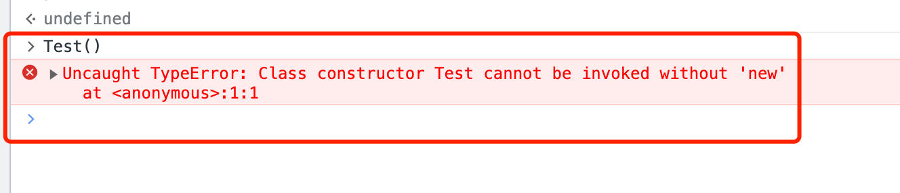
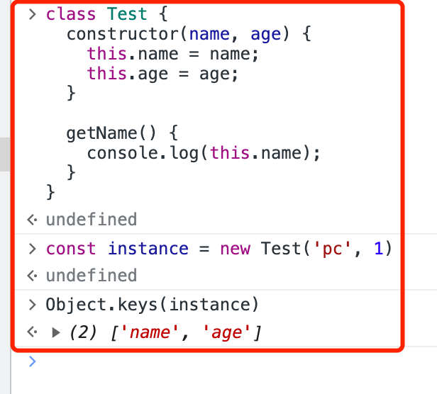
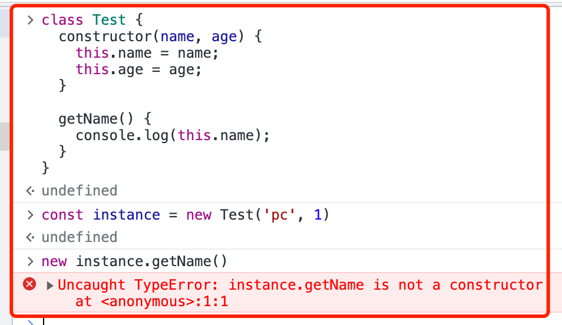

# ES6 Class 转为 ES5

```js
class Test {
  constructor(name, age) {
    this.name = name;
    this.age = age;
  }

  getName() {
    console.log(this.name);
  }
}
```

## 基础转换

```js
'use strict'; // es6 class 在严格模式下执行

function Test(name, age) {
  this.name = name;
  this.age = age;
}

Test.prototype.getName = function () {
  console.log(this.name);
};
```

## class 只能使用 new 调用


判断函数调用的方式

```js{4-10}
"use strict"; // es6 class 在严格模式下执行

function Test(name, age) {
  // 验证this的指向
  const isCalledWithNew = this instanceof Test;
  if (!isCalledWithNew) {
    throw new TypeError(
      "Class constructor Test cannot be invoked without 'new'"
    );
  }
  this.name = name;
  this.age = age;
}

Test.prototype.getName = function () {
  console.log(this.name);
};

```

## class 方法成员不可被枚举



示例中 `class` 的方法 `getName` 不可枚举

```js
'use strict'; // es6 class 在严格模式下执行

function Test(name, age) {
  // 验证this的指向
  const isCalledWithNew = this instanceof Test;
  if (!isCalledWithNew) {
    throw new TypeError("Class constructor Test cannot be invoked without 'new'");
  }
  this.name = name;
  this.age = age;
}

Object.defineProperty(Test.prototype, "getName", {  // [!code ++]
  value: function () {                              // [!code ++]
    console.log(this.name);                         // [!code ++]
  },                                                // [!code ++]
  enumerable: false,                                // [!code ++]
});                                                 // [!code ++]

Test.prototype.getName = function () {  // [!code --]
  console.log(this.name);               // [!code --]
};                                      // [!code --]
```

## class 方法成员不能使用 new 调用



```js
"use strict"; // es6 class 在严格模式下执行

function Test(name, age) {
  // 验证this的指向
  const isCalledWithNew = this instanceof Test;
  if (!isCalledWithNew) {
    throw new TypeError(
      "Class constructor Test cannot be invoked without 'new'"
    );
  }
  this.name = name;
  this.age = age;
}

Object.defineProperty(Test.prototype, "getName", {
  value: function () {
    // 不能使用 new 调用                   // [!code ++]
    if (!(this instanceof Test)) {       // [!code ++]
      throw new TypeError("instance.getName is not a constructor"); // [!code ++]
    }                                    // [!code ++]
    console.log(this.name);
  },
  enumerable: false,
});
```

