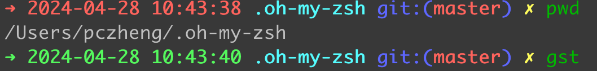

# zsh 给终端主题的命令添加时间
> 这里的 zsh 具体是 on-my-zsh
## 操作步骤

1. 打开 `~/.zshrc` 文件
2. 找到使用的主题名称

```shell
 ZSH_THEME="robbyrussell"
```

3. 定位到对应的主题 `sh` 文件

```sh
vi ~/.oh-my-zsh/themes/robbyrussell.zsh-theme
```

4. 修改文件

```shell:line-numbers {1}
PROMPT="%(?:%{$fg_bold[green]%}➜ :%{$fg_bold[red]%}➜ )"
PROMPT+='%D{%Y-%m-%d %H:%M:%S}' # 给每一条命令添加时间 // [!code ++]
PROMPT+=' %{$fg[cyan]%}%c%{$reset_color%} $(git_prompt_info)'
ZSH_THEME_GIT_PROMPT_PREFIX="%{$fg_bold[blue]%}git:(%{$fg[red]%}"
ZSH_THEME_GIT_PROMPT_SUFFIX="%{$reset_color%} "
ZSH_THEME_GIT_PROMPT_DIRTY="%{$fg[blue]%}) %{$fg[yellow]%}✗"
ZSH_THEME_GIT_PROMPT_CLEAN="%{$fg[blue]%})"
```

对应到行号, 这段配置的解释:
  1. `PROMPT="%(?:%{$fg_bold[green]%}➜ :%{$fg_bold[red]%}➜ )"`
    - 这一行定义了主提示符。它使用了 Zsh 的条件表达式 `%(condition.true.text.false.text)`。
    - 如果上一条命令执行成功（即返回值为 0），则提示符为绿色的箭头 "➜"；否则，为红色的箭头 "➜"。

  2. `PROMPT+='%D{%Y-%m-%d %H:%M:%S}'`
    - 这一行在主提示符后面添加了当前时间的格式化输出，格式为年-月-日 时: 分: 秒。

  3. `PROMPT+=' %{$fg[cyan]%}%c%{$reset_color%} $(git_prompt_info)'`
    - 这一行添加了当前工作目录的显示和 Git 相关信息。
    - `%{$fg[cyan]%}` 设置当前工作目录的颜色为青色。
    - `%c` 表示当前工作目录的路径。
    - `%{$reset_color%}` 用于重置颜色设置。
    - `$(git_prompt_info)` 是一个函数调用，用于获取 Git 仓库的状态信息，并将其显示在提示符中。

  4. `ZSH_THEME_GIT_PROMPT_PREFIX="%{$fg_bold[blue]%}git:(%{$fg[red]%}"`
    - 这一行定义了 Git 仓库信息的前缀部分。
    - `%{$fg_bold[blue]%}` 设置前缀颜色为粗体的蓝色。
    - `%{$fg[red]%}` 设置分支名和提交状态的颜色为红色。

  5. `ZSH_THEME_GIT_PROMPT_SUFFIX="%{$reset_color%} "`
    - 这一行定义了 Git 仓库信息的后缀部分。
    - `%{$reset_color%}` 用于重置颜色设置。

  6. `ZSH_THEME_GIT_PROMPT_DIRTY="%{$fg[blue]%}) %{$fg[yellow]%}✗"`
    - 这一行定义了当 Git 仓库处于脏（即有未提交的修改）状态时的显示。
    - `%{$fg[blue]%}` 设置脏状态标记的颜色为蓝色。
    - `%{$fg[yellow]%}` 设置脏状态标记 "✗" 的颜色为黄色。

  7. `ZSH_THEME_GIT_PROMPT_CLEAN="%{$fg[blue]%})"`
    - 这一行定义了当 Git 仓库处于干净（即没有未提交的修改）状态时的显示。
    - `%{$fg[blue]%}` 设置干净状态标记的颜色为蓝色。

## 效果展示


