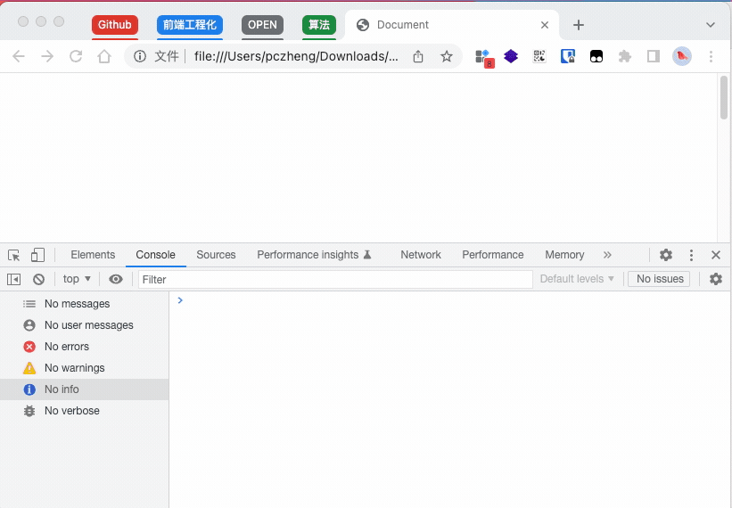

# 判断元素是否在视口中可见

## 使用 **IntersectionObserver** 观察器构造函数

```js
const observer = new IntersectionObserver(
  (entries) => {
    entries.forEach((entry) => {
      if (entry.isIntersecting) {
        // `entry.target` is the dom element
        console.log(`${entry.target.id} is visible`);
      }
    });
  },
  {
    threshold: 1.0
  }
);
observer.observe(document.getElementById('my-button'));
```



```html
<!DOCTYPE html>
<html lang="en">
  <head>
    <meta charset="UTF-8" />
    <meta http-equiv="X-UA-Compatible" content="IE=edge" />
    <meta name="viewport" content="width=device-width, initial-scale=1.0" />
    <title>Document</title>
  </head>
  <body>
    <div id="button" style="margin-top:300px">这是我的元素</div>
    <div id="button1" style="margin-top:300px">这是我的另一个元素</div>
  </body>
  <script type="module">
    const observer = new IntersectionObserver(
      (entries) => {
        entries.forEach((entry) => {
          if (entry.isIntersecting) {
            // `entry.target` is the dom element
            console.log(`${entry.target.id} is visible`);
          }
        });
      },
      {
        threshold: 1.0
      }
    );
    observer.observe(document.getElementById('button'));
    observer.observe(document.getElementById('button1'));
  </script>
</html>
```
